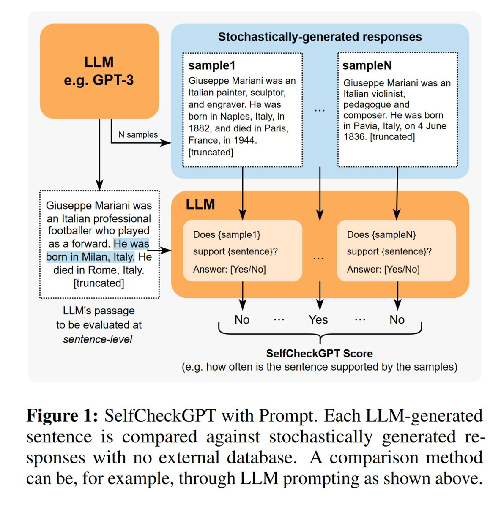

<!-- truncate -->

import { DownloadButton } from '/src/theme/Buttons';

❓Can you really get a LLM to self-check its own responses for hallucinations?

📜Researchers from Cambridge released a [paper](https://arxiv.org/abs/2303.08896) developing a method called SelfCheckGPT - a framework that uses only black-box access to a LLM through an API to assess if it's hallucinating.

⏩TLDR: They pass in the same prompt to the model multiple times and generate N more sample responses in addition to the original response and get the LLM to check for inconsistencies.

📑They compare how often each sentence in the original response contradicts these samples using the following prompt for every sentence:

```bash
Context: {} 
Sentence: {} 
Is the sentence supported by the context above? 
Answer Yes or No: 
```

The intuition is that if an LLM has knowledge of a given concept, sampled responses are likely to be similar and contain consistent facts. Hallucinated statements, on the other hand, are more likely to diverge from the extra sampled responses and will contradict one another.

They report higher AUC-PR scores in sentence-level hallucination detection and higher correlation scores in passage-level factuality assessment compared to grey-box methods - which use model weights and output token probs.

❌Some potential problems with this approach:

1. What if the model hallucinates in a confident way where even the sampled responses contain the hallucinations?

2. Very high-cost method(requires (N + number of sentences) queries per prompt) - if you are generating N samples every time and then verifying for every sentence in a query you will rack up a bill really quickly

<p>
  <DownloadButton link='https://arxiv.org/abs/2303.08896'>🔗 arXiv Link</DownloadButton>
</p>
<p>
  <DownloadButton link='https://arxiv.org/pdf/2303.08896'>📜 Download paper</DownloadButton>
</p>

<!-- We could create a specific template for Paper Review's -->
import WhatNext from '/_includes/what-next.mdx'

<WhatNext />
