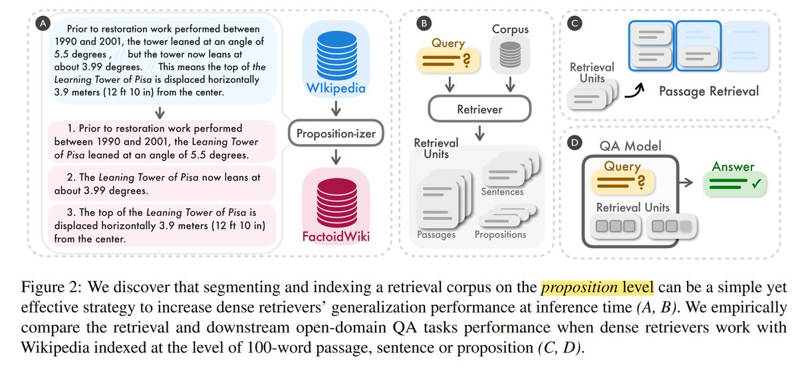

<!-- truncate -->

import { DownloadButton } from '/src/theme/Buttons';

❓What text chunk size should we use in our RAG workflows? How does chunk size impact retrieval recall? Are bigger chunks better? Smaller chunks but keep more top-k?

📜The new paper from Tencent and Carnegie Mellon(https://arxiv.org/abs/2312.06648) asked:
1. What chunk size is best to segment and index a vector database like 
@weaviate_io
?
2. How does chunk size impact generalization for passage retrieval and accuracy for QA RAG tasks?

⏩In Short: They found that instead of using 100-word passage or sentence-level chunking it's best create Propositions - concise, distinct and self-contained expressions of factoids. 

Propositions are generated by a finetuned LLM - which takes in paragraphs as input and is instructed to generate propositions.(blue in the image)

Going to try this out with the current 
@weaviate_io
 workflows.

📑The details:

1. QnA RAG Improvements: +5.9, +7.8,+5.8, +4.9, +5.9, and +6.9 EM@100(exact match using 100 words) for SimCSE, Contriever, DPR, ANCE, TAS-B, and GTR.

2. Passage Retrieval Perf. : Improvement of Recall@20 is +10.1% and +2.2% for unsupervised and supervised retrievers resp.

3. Propositions have the following properties:
  a. unique: a distinct piece of meaning in text
  b. atomic: cannot be further split into separate propositions
  c. self-contained: includes all the necessary context

4. The paragraph-to-proposition generating LLM (a FlanT5-large model) is finetuned using a 42k passage dataset that has been atomized into propositions using GPT-4 - ie. the process is automatable.

5. Supervised retrievers show less improvements with Propositions b/c these retrievers are trained on query-passage pairs.

6. Unsupervised retrieval by proposition demonstrates a clear advantage - 17-25% Recall@5 relative improvement on EntityQuestions with DPR and ANCE.

7. Works better for rare concepts: Retrieving by proposition much more advantageous for questions targeting less common entities.

8. The RAG (retrieve-then-read) task uses a T5-large size UnifiedQA-v2 as the reader model.

9. Proposition chunks outperform passage chunks for QnA most in the range of 100-200 words = ~10 propositions = ~5 sentences = ~2 passages.

  <DownloadButton link='https://arxiv.org/abs/2312.06648'>🔗 arXiv Link</DownloadButton>

  <DownloadButton link='https://arxiv.org/pdf/2312.06648'>📜 Download paper</DownloadButton>

<!-- We could create a specific template for Paper Review's -->
import WhatNext from '/_includes/what-next.mdx'

<WhatNext />
