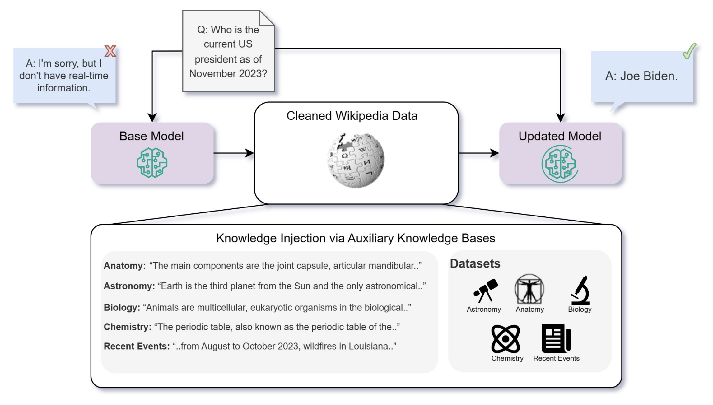

<!-- truncate -->

import { DownloadButton } from '/src/theme/Buttons';

❓When using LLMs is unsupervised fine-tuning better than RAG for knowledge-intensive tasks? Should you do both?

If you want to augment an LLM with knowledge of your enterprise data you can do so by augmenting the parametric (finetune) or non-parametric(w/ a vector db like 
@weaviate_io
) memory.

📜Researchers from Microsoft(https://arxiv.org/abs/2312.05934) asked if unsupervised next token prediction finetuning is better than RAG to improve LLM perf. on both seen and unseen QnA tasks?

⏩In Short: RAG is a better way to inject knowledge into LLMs than unsupervised fine-tuning(USFT) and more surprisingly they found that RAG alone is even better than RAG + finetuning. Probably because USFT is not efficiently persisting new knowledge into params.

Would be cool to see a study comparing RAG vs. SFT/Instruction tuning or RLHF.

This improvement in QnA tasks with RAG occurred for both questions in the MMLU dataset as well as on a new dataset of "current events" that the model was not trained on.

📑The details:
1. Used Mistral, Llama2, Orca2 7B for all assessments.

2. Only unsupervised finetuning was done - a direct continuation of the pre-training phase - by predicting the next token on the dataset

3. Used bge-large-en as the embedding model for the RAG component

4. Finetuning with multiple paraphrases of the same fact provides a significant improvement over the baseline. - To teach pre-trained LLMs new knowledge, the knowledge must be repeated in numerous ways

❌ Limitations/Short-comings:
1. Only a continuation of the pre-training was assessed - no instruction tuning or RLHF - SFT and RLHF will boost performance further.

2. Accuracy performance variance is quite high across the experiments - so it's quite hard to determine the statistical significance of results. 

3. Why is the performance of baseline models on future data not 25% for MCQs with 4 choices? - Not truly "unseen" knowledge. 

4. Only straightforward knowledge/fact tasks were assessed - reasoning capabilities were not assessed..

  <DownloadButton link='https://arxiv.org/abs/2312.05934'>🔗 arXiv Link</DownloadButton>

  <DownloadButton link='https://arxiv.org/pdf/2312.05934'>📜 Download paper</DownloadButton>

<!-- We could create a specific template for Paper Review's -->
import WhatNext from '/_includes/what-next.mdx'

<WhatNext />
