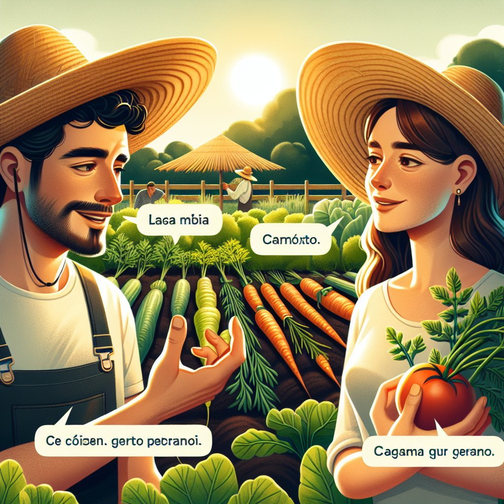
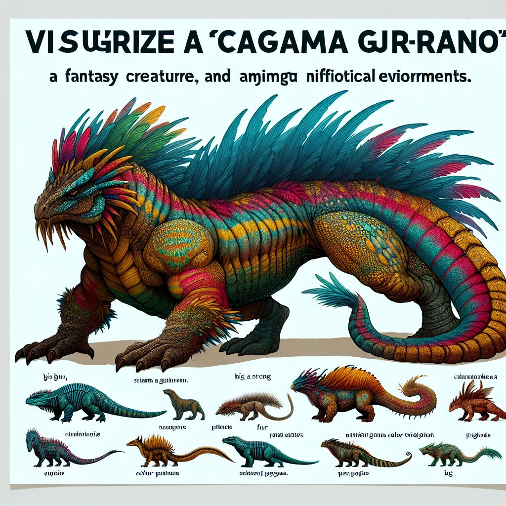

<!-- truncate -->

import { DownloadButton } from '/src/theme/Buttons';

⁉️TIL that text2image diffusion models learn and use a secret language.

Tested this with the new DALL-E-3 and it works!🤯

Read a couple of papers and they mentioned that diffusion models when forced to output text generate images of gibberish words.

If you take those words and pass them back in as prompts, the model can draw for you what the word means to it.

For example: "cagama gur gerano" = "a fantasy creature"

I tested this for the newly released DALL-E-3 model and, interestingly, even when told to generate English it still uses this secret learned language instead.

Below is a conversation about fantasy creatures between two farmers in this secret language.

Initial prompt: "Two farmers talking about vegetables, with english subtitles."

After this just prompt the model with individual and word pairs to get images with secret words. I share examples below.

Prompt: "cagama gur gerano"

  <DownloadButton link={require('./download/2206.00169.pdf').default}>Download the paper - as a button</DownloadButton>

<!-- We could create a specific template for Paper Review's -->
import WhatNext from '/_includes/what-next.mdx'

<WhatNext />
