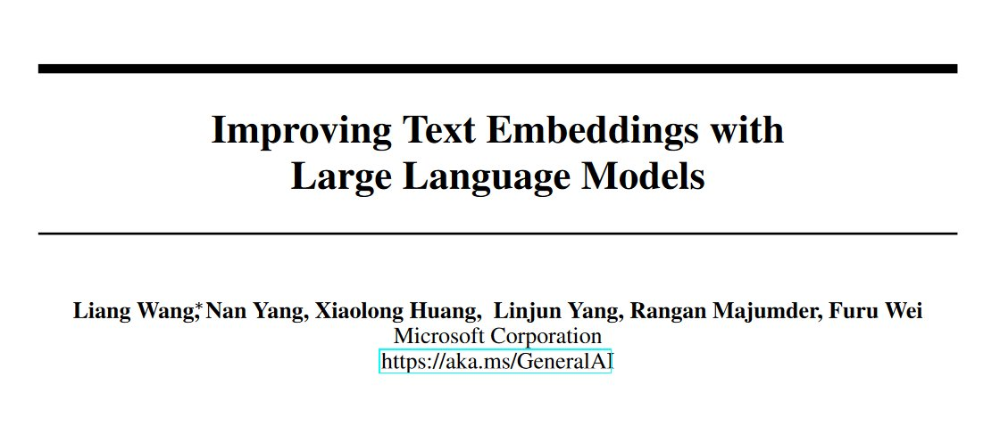
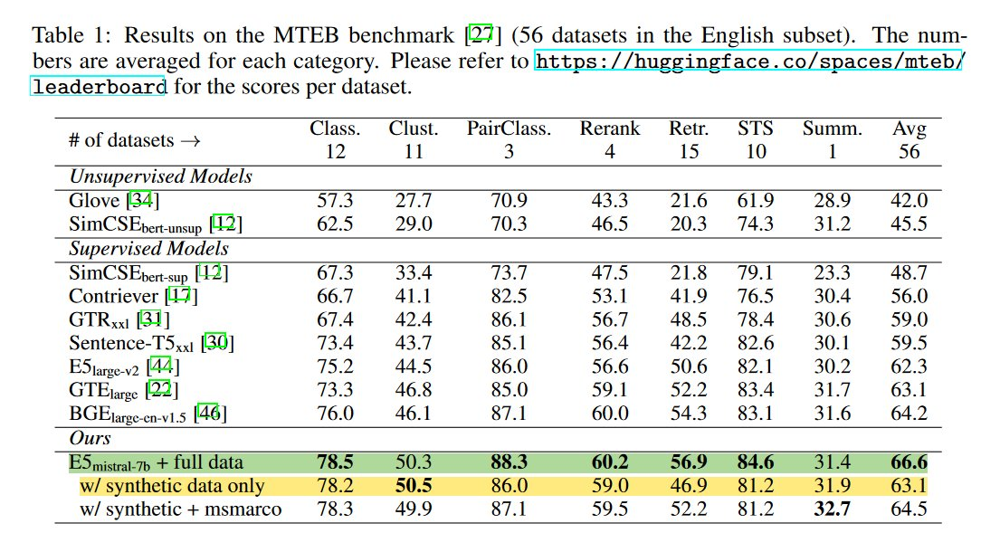
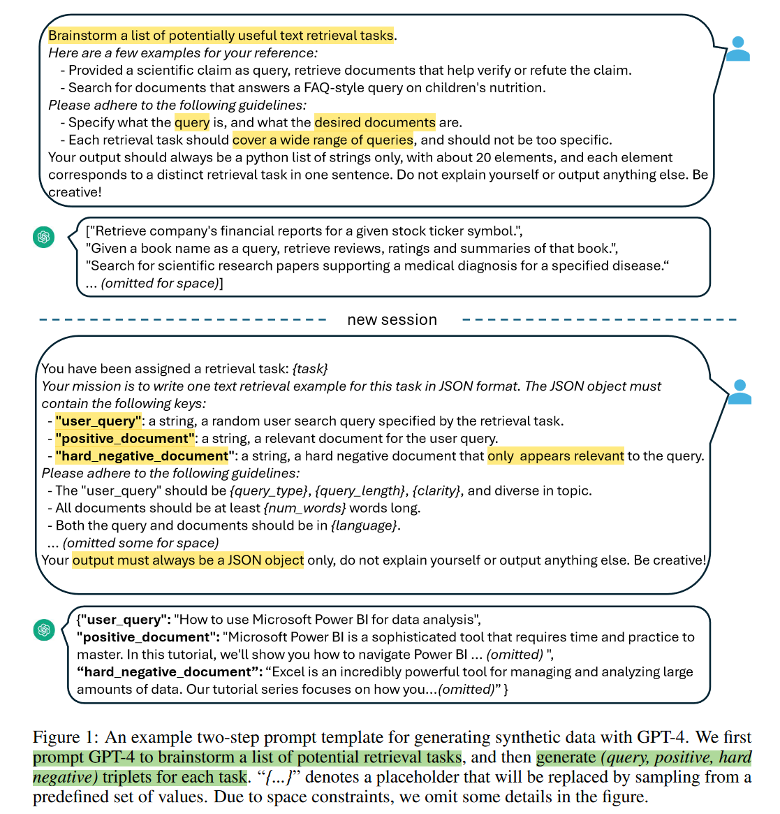
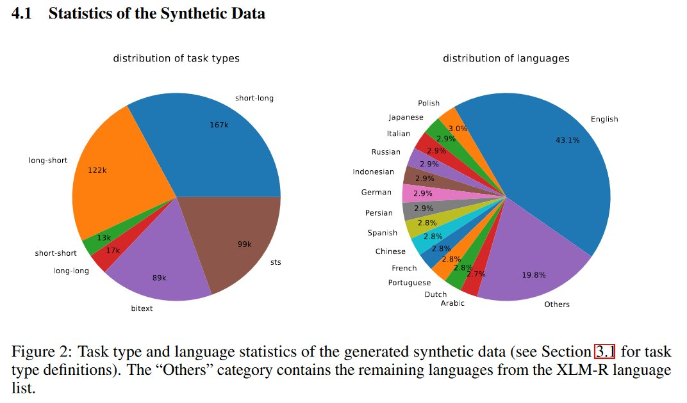
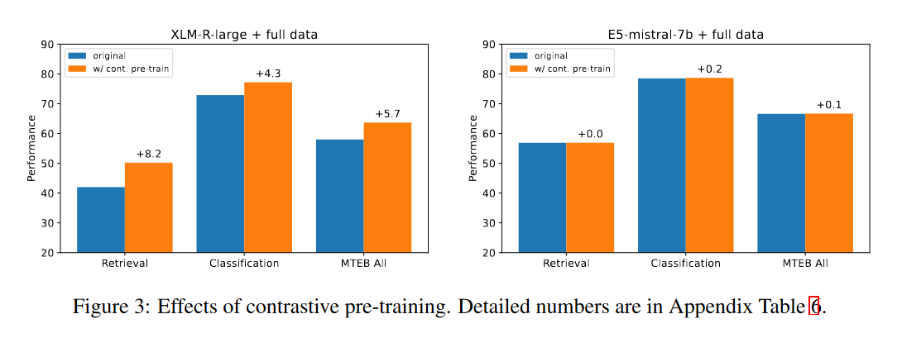

<!-- truncate -->

import { DownloadButton } from '/src/theme/Buttons';

❓Your RAG workflow is only as good as the retrieved context. Can you use LLMs to improve recall and search relevance for dense retrievers?🤔

📜Work from [Microsoft](https://arxiv.org/abs/2401.00368) uses synthetic data + LLMs as embedding models to achieve SOTA on the MTEB benchmark.

⏩In Short: 

1. They generate a multilingual synthetic retrieval dataset using GPT-4 which includes {queries, positive matches, hard negatives}. 

2. They use this synthetic dataset along with 13 other public datasets and embed the queries & positives/negatives using the last layer vectors of Mistral-7B.

3. They tune the Mistral-7B embedding model using a contrastive loss along with embeddings from step 2.

4. Using this fine-tuned Mistral-7B as an embedding model then achieves SOTA(+2.4%) on MTEB.

❌ Limitations/Short-coming: Potential data contamination? Didn't Mistral-7B have access to all MTEB benchmark datasets? - The MTEB was released(Oct 2022) before the training cutoff(~2023) of the model. So there might be some contamination since we are using the LLM to embed this same data.

- maybe I just don't understand!🤷

📑The details:

1. The synthetic data generation consists of prompting GPT-4 to brainstorm a list of potential retrieval tasks followed by getting GPT-4 to generate (query, positive, hard negative) triplets for each task.

2. This synthetic data captures text embedding tasks in 93 languages, covering 1000's of embedding tasks. - see prompt templates for how this diversity is obtained and the different tasks that are generated

3. Fine-tune Mistral-7B using standard contrastive loss with a temperature-scaled cosine similarity with LoRA with rank 16.

4. For Mistral-7B based models, contrastive pre-training has negligible impact on the model quality. This is surprising since it's one of the key factors behind the success of existing text embedding models.

🚀Pretty cool work overall, anytime an LLM augments a well studied field and beats SOTA it's exciting times! They show that language modeling and text embeddings are two sides of the same coin.🪙 

Given an embedding task prompt template, a robust LLM should be able to generate training data and then be transformed into an embedding model through light-weight fine-tuning.

  <DownloadButton link={require('./download/2401.00368.pdf').default}>Download the paper - as a button</DownloadButton>

<!-- We could create a specific template for Paper Review's -->
import WhatNext from '/_includes/what-next.mdx'

<WhatNext />
