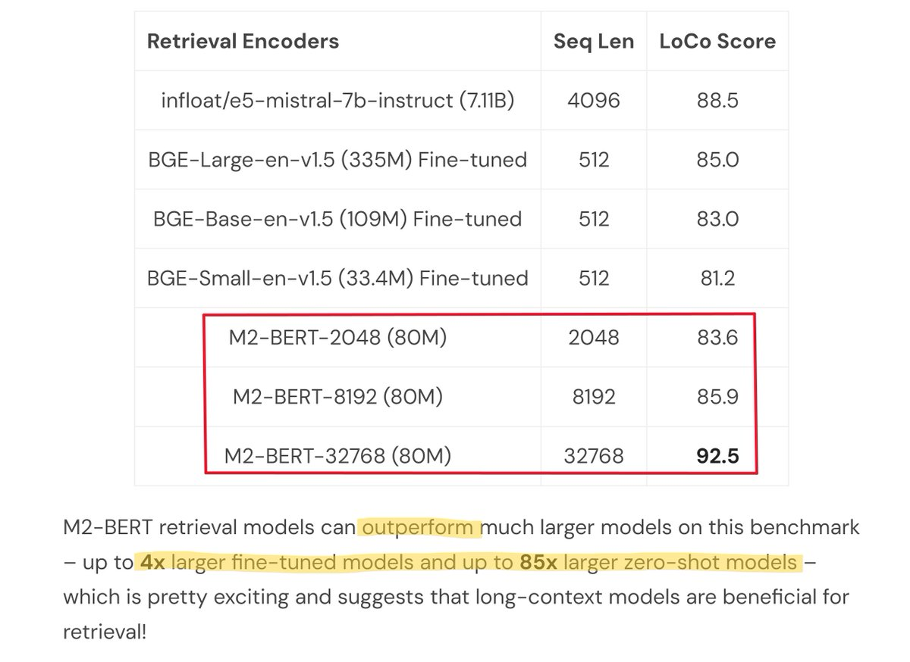

<!-- truncate -->

import { DownloadButton } from '/src/theme/Buttons';

A breakdown of the Long Context Retrieval Embedding Models from Stanford!💥 

### In Short⏩:
1. They release 3 long context(2k/8k/32k) BERT-like encoder embedding models on HuggingFace

2. The models are only 80M params and outperform MUCH larger models (4-85x larger)

3. Accessible via @togethercompute endpoints and integrated into @llama_index and @LangChainAI

4. They also release LoCo a long context retrieval benchmark.

### 🏗️Architechtural Details: 

1. They replace the Attention and MLP blocks in the transformer architecture with diagonal block matrix (Monarch Matrices -M2) operations which are hardware optimized and subquadratic in the sequence length - O(N^(1.5)) 

2. This enables scaling sequence length and model parameters better.

### 🪃Training Details:

1. These M2 models are trained for long context retrieval on a mixture of long and short context tasks data - surprisingly only training on long context doesn't work.

2. Use a cosine similarity loss instead of the trusty supervised contrastive training loss. 
    > This loss function. can be computed independently per datapoint in a batch instead of needing to sum over all negative examples in a batch. 

    > Thus training can be scaled for large batch sizes of long context inputs without OOM'ing

[📜Blog](https://hazyresearch.stanford.edu/blog/2024-01-11-m2-bert-retrieval)

[🧑‍💻Code](https://github.com/HazyResearch/m2)

[🔷Models](https://huggingface.co/togethercomputer/m2-bert-80M-32k-retrieval)

  <DownloadButton link='https://arxiv.org/abs/2310.12109'>🔗 arXiv Link</DownloadButton>

  <DownloadButton link='https://arxiv.org/pdf/2310.12109'>📜 Download paper</DownloadButton>

<!-- We could create a specific template for Paper Review's -->
import WhatNext from '/_includes/what-next.mdx'

<WhatNext />
