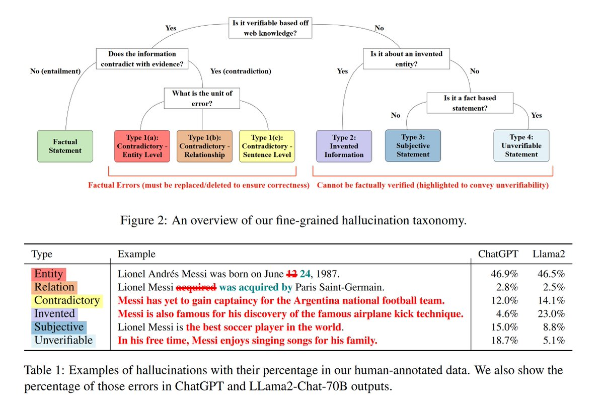

<!-- truncate -->

import { DownloadButton } from '/src/theme/Buttons';

### A breakdown of the different types of hallucinations from AI2:🍄

1. Verifiably Factually Wrong ❌

  - Entity: an entity in a statement is incorrect (eg. Christmas falls on Nov. 25th)

  - Relation: semantic relationship in a statement is incorrect (eg. The mouse ate the cat.)

  - Contradictory: statements that entirely contradict relevant evidence from the web (eg. Raptors are yet to win an NBA final.)

2. Unverifiable Types of Hallucinations ⁉️

  - Invented: statements of concepts that do not exist in world knowledge (eg. MJ created the sideways somersault)

  - Subjective: Statement that lacks universal validity - basically an opinion (eg. The Raptors are the best NBA team)

  - Unverifiable: potentially factual statement but cannot be grounded in world evidence(eg. Jensen sleeps in a leather jacket.)

### 🔍Word vs. Sentence Level:
  > Entity and Relation are usually word level, and so can be fixed with small edits if you know where they occur.

  > Contradictory, Invented, Subjective, and Unverifiable are often sentence level and thus need to be removed completely to fix the issue.

[💻Code](https://fine-grained-hallucination.github.io)

  <DownloadButton link={require('./download/2401.06855.pdf').default}>Download the paper - as a button</DownloadButton>

<!-- We could create a specific template for Paper Review's -->
import WhatNext from '/_includes/what-next.mdx'

<WhatNext />
