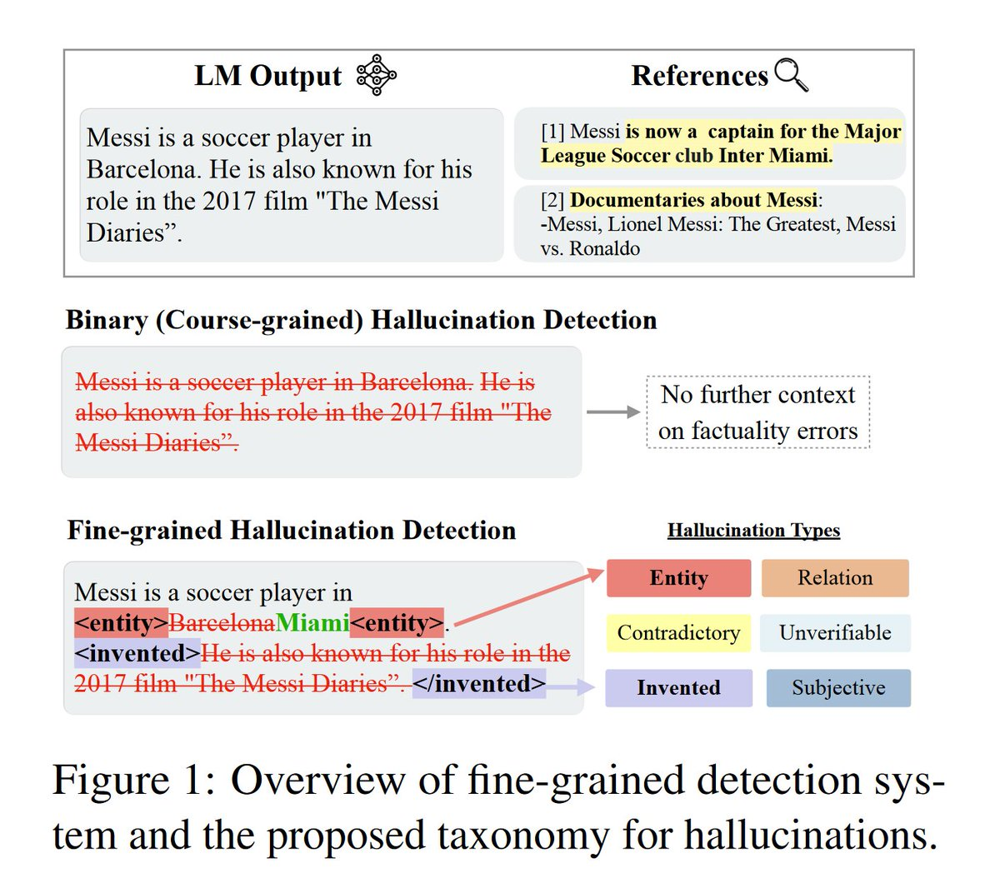

<!-- truncate -->

import { DownloadButton } from '/src/theme/Buttons';

## Using a 7B Model + RAG to Identify and Edit Word-level Hallucinations in LLMs better then GPT-4:

### In Short⏩:

  > Train a model that consists of a Retreiver and a Language Model:  

    >> The retriever, Mret, takes the original output you want to check to hallucination (y) and optionally input prompt (x) and retrieves top relevant documents (C). So C = Mret(x, y). This can be a vector database like Weaviate for example.

    >> The detector and editor, Medit, takes in the context - (C), input - (x) and output - (y) and detects (and if possible also edits/corrects) factual errors in (y) given the retrieved context (C): y* = Medit(x, y, C).

### 🏋️Training:

  > Create a synthetic hallucination dataset of 35k C = context, y=incorrect output, y*=annotated fixed output -> (C, y, y*) 

  > Magic Synthetic Dataset Creation: 

    >> GPT-4 is few-shot prompted to add different types of errors to a passage

    >> It is also instructed to mark phrases or sentences for deletion along with their error type and insert phrases and sentences along with insertion tags

  > Start off with Llama2-Chat 7B to initialize Medit and then train on (C, y, y∗) 

  > Medit takes in (C, y) as input and learns to predict the edited outputs with tags to represent error type y∗ using standard language modeling objective.

  > The model, once trained, can identify different types of hallucination and mark which words they come from - it also suggests edits to improve factuality.

### Result 📈:
The model has a fine-grained hallucination detection accuracy 46.5% while it's binary acc.{hallucination, no hallucination} is 79%.

For comparison ChatGPT has a fine-grained hallucination detection acc. of 21.5% (59% binary acc) w/o RAG and 26%(68.5% binary hall detect) w/ RAG

[💻Code](https://github.com/abhika-m/FAVA)

[🔷Data](https://huggingface.co/datasets/fava-uw/fava-data)

[🏗️Model](https://huggingface.co/fava-uw/fava-model)

  <DownloadButton link='https://arxiv.org/abs/2401.06855'>🔗 arXiv Link</DownloadButton>

  <DownloadButton link='https://arxiv.org/pdf/2401.06855'>📜 Download paper</DownloadButton>

<!-- We could create a specific template for Paper Review's -->
import WhatNext from '/_includes/what-next.mdx'

<WhatNext />
