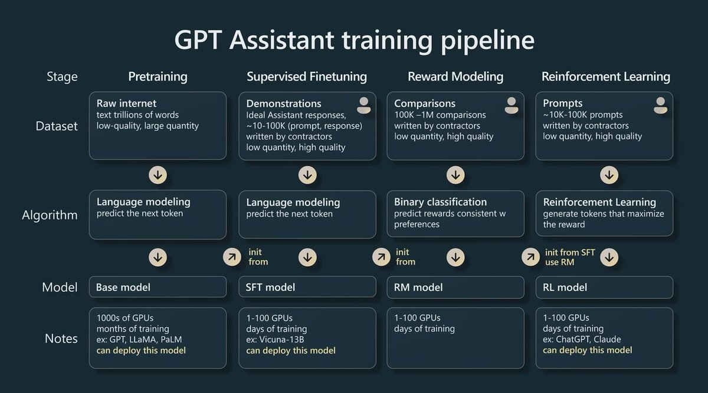

<!-- truncate -->

import { DownloadButton } from '/src/theme/Buttons';

A Simple Overview of the LLM Training Steps:🔡

1. Unsupervised Pretraining: 

  >> High quantity, low quality data 
  >> The model is trained to predict the next token for trillions of tokens. 
  >> Produces what is called the foundation or base model.  

2. Supervised Finetuning:

  >> Low quantity, high quality {prompt, response}
  >> Enables the model to be finetuned for dialogue - turning the base model into a chatbot
  >> Often referred to as instruction tuning

3. Reinforcement Learning from Human Feedback (RLHF): - lots of innovation going on here (will cover DPO, PTO, and KTO soon)

This is a two-step process:

a. Train a reward model to act as a scoring function:
  >> This model will take in a prompt + response and provide a score of how good it is. 
  >> Human labelers are asked to pick good vs. bad responses and this data is used to train a model.

b. Optimize LLM to generate responses for which the reward model will give high scores. 

  >> Use an iterative procedure to update a part of the model such that:
    >> 1. Produces outputs with higher score
    >> 2. Outputs that are not too far away from the SFT model from Step 2
    >> 3. Outputs that aren't getting worse a text completion 

Specifically for this phase it is better to think of this as learning an optimal strategy/policy for predicting a probability distribution over tokens and we want to tweak this distribution to produce higher quality text, here the:

  >> The policy is a language model that takes in a prompt and returns a probability distribution over text. 
  >> The action space of this policy is all the tokens corresponding to the vocabulary of the language model (~50k tokens) 
  >> The observation space: distribution of possible input token sequences
  >> The reward Model is a combination of the preference model(score higher) and a constraint on policy shift(don't change too much, get worse at text completion).

RLHF Learning Resources:

1. [InstructGPT Paper](https://arxiv.org/pdf/2203.02155.pdf)

2. [RLHF Paper Anthropic](https://arxiv.org/pdf/2204.05862.pdf)

3. [OpenAI Blog](https://openai.com/research/instruction-following)

4. [RLHF Blog Chip Huyen](https://huyenchip.com/2023/05/02/rlhf.html)

5. [RLHF Nathan Lambert](https://interconnects.ai/p/how-rlhf-works)

6. [Karpathy Talk](https://youtube.com/watch?v=bZQun8Y4L2A&ab_channel=MicrosoftDeveloper)

<!-- We could create a specific template for Paper Review's -->
import WhatNext from '/_includes/what-next.mdx'

<WhatNext />
