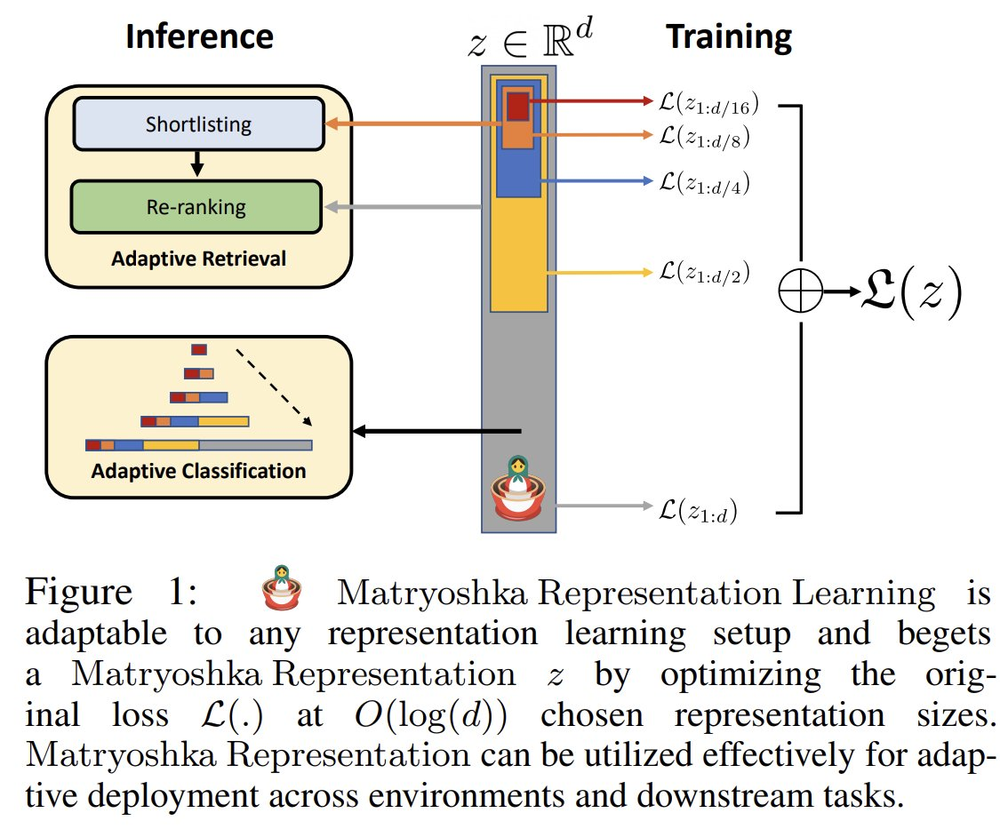

<!-- truncate -->

import { DownloadButton } from '/src/theme/Buttons';

### An Overview of OpenAI's New Truncatable - Matryoshka Embeddings🪆

OpenAI recently announced embeddings that you can simply use chunks of (say the first 8, 16, 32, 64, 128 or 256 ... dimensions of the total 2048d vector) they use Matryoshka representation learning(MRL). 

This is how they work, In Short⏩:

- MLR allows you to use a subset of the dimensions of the embedding vector - earlier dimensions store more information than dimensions later on in the vector, which simply add more details
 
- You can understand how this works by the analogy of trying to classify an image at multiple resolutions - the lower res give high-level info and the higher res add details - Human perception of the natural world also has a naturally coarse-to-fine granularity

- This is done by modifying the loss function which is optimized. If previously the loss function was L, for MRL we break down the Loss function into the sum of the losses on individual vector dimension ranges: Loss_Total =  L(upto 8d) + L(upto 16d) + L(upto 32d) + ... + L(upto 2048d) - Now there is incentive for the model to capture information in each sub-section of the vec.

- After modifying the loss you get these truncatable vectors for free/no additional costs - this works on almost all loss functions and pre-existing models can be finetuned to output MRL vectors! - super easy-to-adopt technique

- You can actually use any slice of dimensions, not just 8, 16,32 ... - b/c information is diffused in an interpolative fashion; so you can choose an arbitrary-sized chunk dimension that falls between the chosen granularity of the representations

  <DownloadButton link={require('./download/2205.13147.pdf').default}>Download the paper - as a button</DownloadButton>

<!-- We could create a specific template for Paper Review's -->
import WhatNext from '/_includes/what-next.mdx'

<WhatNext />
