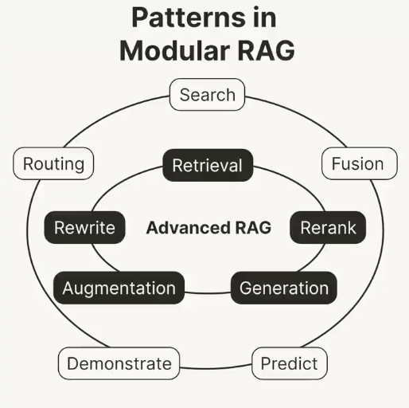

<!-- truncate -->

import { DownloadButton } from '/src/theme/Buttons';

A recent survey on Retrieval-Augmented Generation (RAG) mentions an evolving paradigm:
Modular RAG. 

Modular RAG is comprised of various functional modules. Thus, modular RAG is not standalone. Instead, different RAG patterns are composed of different modules.   

For example, the following animation shows: 
🥚 The original naive RAG paradigm consists of the “Retrieval”, "Augmentation," and "Generation" modules.

🐣 After naive RAG has shown some limitations, advanced RAG has emerged as a new paradigm. A typical pattern of Advanced RAG builds upon the foundation of Naive RAG by adding “Rewrite” and “Rerank” modules. 

🐓 Different RAG patterns, such as DSP, can be composed of entirely different modules.  

The modular RAG paradigm is slowly becoming the norm in the RAG domain due to its versatility and flexibility, allowing: 
- the adaption of modules within the RAG process to suit your specific problem, 
- for a serialized pipeline or an end-to-end training approach across multiple modules.

I definitely recommend checking out the full survey if you want to catch up on recent advancements in the RAG domain.

  <DownloadButton link='https://arxiv.org/abs/2312.10997'>🔗 arXiv Link</DownloadButton>

  <DownloadButton link='https://arxiv.org/pdf/2312.10997'>📜 Download paper</DownloadButton>

<!-- We could create a specific template for Paper Review's -->
import WhatNext from '/_includes/what-next.mdx'

<WhatNext />
