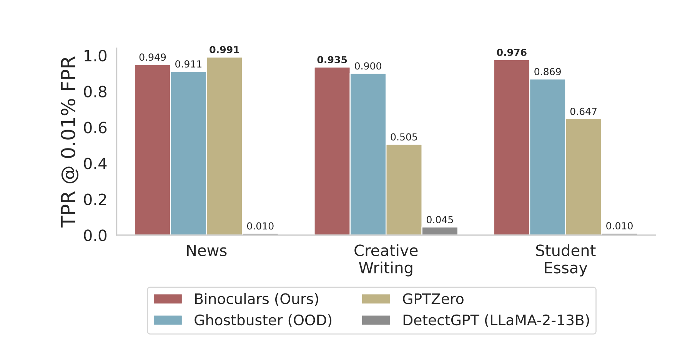

<!-- truncate -->

import { DownloadButton } from '/src/theme/Buttons';

Can you reliably tell apart fake, LLM-generated, text from human-written text?🤖⚖️👱

Binoculars is a technique that requires no training and can 0-shot detect 90% of LLM-generated content at a 0.01% false positive rate.

### In Short⏩:
Human tokens are, on average more surprising to LLMs than other LLM tokens. They use this insight to identify a classification threshold.

Given two LLMs, M1 and M2. Their main insight is that human text should diverge from M1 more than M2 diverges from M1, provided the LLMs M1 and M2 are more similar to each other than they are to a human.

### Details🔎:
They look at the text in question through the lenses of two different LMs and calculate two perplexity scores:

1. Perplexity of the text using an "observer" LLM(M1).

2. Compute all the next-token predictions that a "performer" LLM(M2) would make at each position in the string, and compute their perplexity according to the "observer" LLM(M1).

Then, they take the ratio of the two PPL scores: PPL1/PPL2. 

If the string is written by a machine, we should expect these two perplexities to be similar. If it is written by a human they should be different.

>> They find that if PPL1/PPL2 > 0.9 then text is human generated; otherwise it's LLM generated.

>> Works on detecting fake multilingual text as well.

>> They think of PPL as how surprising the next token is - human tokens are, on average more surprising to LLMs than LLM tokens.

>> They use PPL2, what they call cross perplexity, to account for the increase in perplexity due to the prompt; normalizing the observed perplexity by the expected perplexity of a machine acting on the same text, we can arrive at a detection metric that is fairly invariant to the prompt

>> They use Falcon-7b model (M1) and the Falcon-7b-instruct (M2)

[🧑‍💻Code](https://github.com/ahans30/Binoculars/tree/main
[🤗HuggingFace Demo](https://huggingface.co/spaces/tomg-group-umd/Binoculars)

  <DownloadButton link={require('./download/2401.12070.pdf').default}>Download the paper</DownloadButton>

<!-- We could create a specific template for Paper Review's -->
import WhatNext from '/_includes/what-next.mdx'

<WhatNext />
