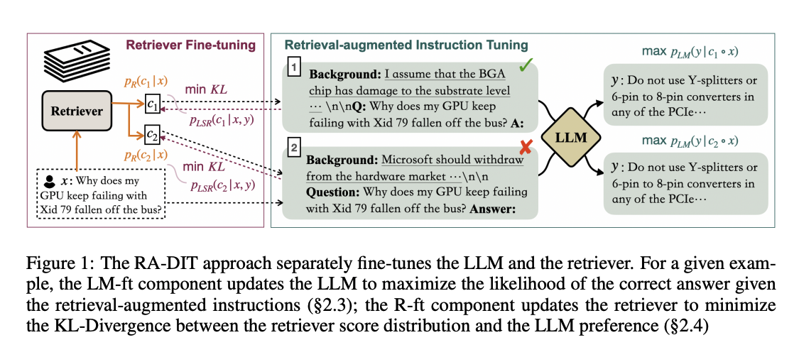

<!-- truncate -->

import { DownloadButton } from '/src/theme/Buttons';

Can we finetune our LLM and retriever together to improve RAG performance?
This paper proposes a technique to do exactly that!

### RAG Basics:
When you prompt an LLM, RAG supplies relevant documents. A separate retrieval model computes the probability of each text chunk being relevant and provides the top chunks to the LLM. The LLM generates tokens based on the chunks, prompt, and previous tokens.

### In Short:
Fine-tuning LLMs and retrieval models together improves performance without extensive data processing, enabling better retrieval-augmented generation.
LLMs aren't exposed to retrieval-augmented inputs during pretraining, limiting their ability to use retrieved text effectively. Fine-tuning the LLM and retrieval model together can improve performance without requiring extensive data processing.

### How it Works:
Authors from Meta fine-tuned Llama 2 (65B parameters) and DRAGON+, a retriever, to create RA-DIT 65B. They fine-tuned Llama 2 on prompts with retrieved text and questions, and fine-tuned DRAGON+ to retrieve more relevant chunks. Fine-tuning was supervised for tasks like question-answering and self-supervised for text chunk completion.

### Results:
RA-DIT 65B achieved 49.1% accuracy on average across four question datasets, outperforming LLaMA 2 65B with DRAGON+ (45.1%) and LLaMA 2 65B alone (32.9%). With five example inputs, RA-DIT 65B reached 51.8% accuracy.
RA-DIT offers an efficient way to enhance LLM performance with RAG, making it a valuable technique for developers.

### Details:
RA-DIT fine-tunes Llama 2 and DRAGON+ to work together effectively, leveraging the strengths of both models to generate better output. By fine-tuning the LLM to better use retrieved knowledge and the retrieval model to select more relevant text, RA-DIT achieves improved performance without requiring extensive data processing.

  <DownloadButton link='https://arxiv.org/abs/2310.01352'>🔗 arXiv Link</DownloadButton>

  <DownloadButton link='https://arxiv.org/pdf/2310.01352'>📜 Download paper</DownloadButton>

<!-- We could create a specific template for Paper Review's -->
import WhatNext from '/_includes/what-next.mdx'

<WhatNext />
