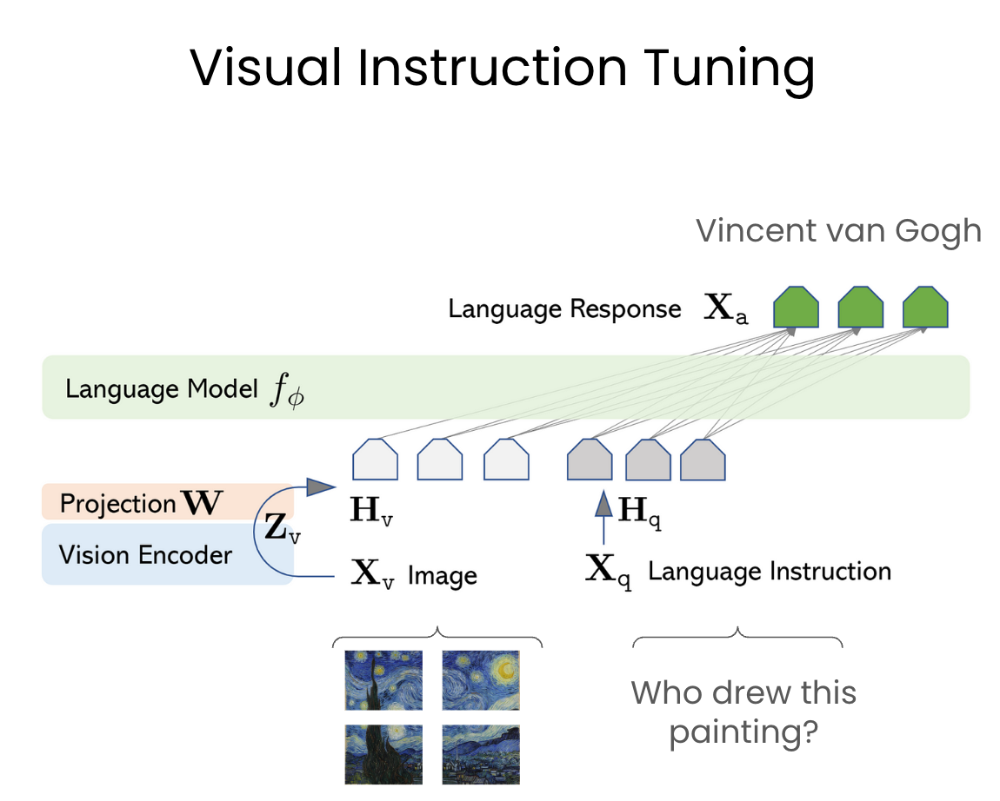

<!-- truncate -->

import { DownloadButton } from '/src/theme/Buttons';

How do you teach a Large Language Model to see? Here's a breakdown!

This paper proposes a technique called Visual Instruction Tuning that is now used by many of the language vision models we see in the field such as LLaVA, GPT4-Vision and Gemini etc.

### In Short:
The paper introduces a method to generate multimodal language-image instruction-following data using a language-only GPT-4 model. This data is then used to train LLaVA, a model that combines a vision encoder and a large language model (LLM) for general-purpose visual and language understanding.

### How it Works:
VIT works by using GPT-4 to generate instructions for corresponding images and captions. This dataset is used to train LLaVA to learn to follow instructions and understand images. A vision encoder (CLIP ViT 40) is combined with an LLM (Vicuna) to process text and images and generate text.

### Architecture:

LLaVA consists of two main components:

  1. Vision Encoder (VE): A pre-trained vision encoder (e.g. CLIP) that takes an image as input and generates a visual embedding.

  2. Large Language Model (LLM): A pre-trained LLM (Vicuna) that takes a text prompt as input and generates a language embedding.

The VE and LLM are combined through a series of layers and mechanisms to enable multimodal understanding and generation:

### Benefits:

The combination of the VE and LLM enables LLaVA to understand and generate text and images in a unified framework, leverage the strengths of both visual and language models, generalize to unseen images and text prompts.

### Results:

LLaVA achieves a 85.1% relative score compared to GPT-4 on a synthetic multimodal instruction-following dataset

### Details in the Paper:
  - The VIT generation process, including prompt engineering and filtering

  - The LLaVA architecture, including the vision encoder and LLM components

  - Experimental results, including comparisons to GPT-4 and other baselines

  - Ablation studies and analysis of the effectiveness of different components and training strategies

  <DownloadButton link='https://arxiv.org/abs/2304.08485'>🔗 arXiv Link</DownloadButton>

  <DownloadButton link='https://arxiv.org/pdf/2304.08485'>📜 Download paper</DownloadButton>

<!-- We could create a specific template for Paper Review's -->
import WhatNext from '/_includes/what-next.mdx'

<WhatNext />
