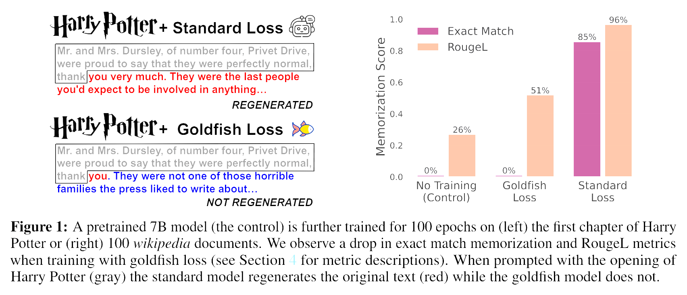

<!-- truncate -->

import { DownloadButton } from '/src/theme/Buttons';

## How do you train a Large Language Model without it memorizing training data?

This paper proposes a technique called Goldfish Loss that is now used to mitigate the risk of LLMs memorizing copyrighted or private training data.

### In Short: 
The paper introduces Goldfish Loss, a method where the model does not compute the loss on every token but excludes (e.g.) 1 in 4 tokens from loss computation. This makes it difficult for the model to memorize the training data.

### How it Works: 
Goldfish Loss works by omitting a portion of tokens from loss computation during training. When the model encounters these excluded tokens at test time, it has to guess, reducing its ability to reproduce training samples exactly.

### Effectiveness:
In standard training on Wikipedia articles, about 85% of them get perfectly memorized after 100 updates. With Goldfish Loss, the model usually diverges from the training data within the first 5 tokens it generates.

### Trade-off: 
The model learns slower because it does not get credit for the dropped tokens. Training on N tokens with Goldfish Loss is equivalent to standard training on 0.75N tokens.

### Benefits: 
Goldfish training is scalable and helps avoid the need for unlearning methods, which are often not scalable. This makes it possible to prevent the memorization of copyrighted text/code during training.

### Results: 
The paper validates Goldfish Loss by pre-training a model for 200B tokens, showing that it effectively prevents memorization without significantly compromising the learning rate.

### Details in the Paper:
- Explanation of the Goldfish Loss technique
- Comparison of memorization rates with standard training
- Analysis of the trade-offs between learning rate and memorization prevention
- Validation experiments and results

[Code](https://github.com/ahans30/goldfish-loss)

  <DownloadButton link='https://arxiv.org/abs/2406.10209'>🔗 arXiv Link</DownloadButton>

  <DownloadButton link='https://arxiv.org/pdf/2406.10209'>📜 Download paper</DownloadButton>

<!-- We could create a specific template for Paper Review's -->
import WhatNext from '/_includes/what-next.mdx'

<WhatNext />
