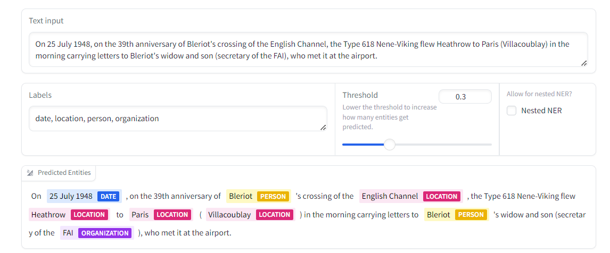

<!-- truncate -->

import { DownloadButton } from '/src/theme/Buttons';

## Using Metadata Filters to Improve Recall in RAG

Filtered search using metadata filtering is a simple technique that can significantly improve retrieval quality in a RAG pipeline, but how do you extract metadata from chunks if your data doesn't already come with it??

GLiNER is a powerful model that allows you to extract arbitrary entities such as names, times, places, etc. from any text chunk. It outperforms decoder models like ChatGPT and others at zero-shot identification of names entities in text chunks.

##How it Works:

GLiNER operates by taking in text chunks and entity labels, that you want to identify in the chunks. Both inputs are concatenated, encoded, and projected into the same latent space and fed into a classifier that predicts the entity labels per word in the text input.

This method allows the model to generalize across different NER tasks and labels passed in at query time.

The fact that entity vectors and the text chunk is concatenated allows the entity labels to attend to the text chunks and vice versa in the encoder step which allows GLiNER to work very well OOD.

##Architechture:

GLiNER consists of three joined components:

1. An encoder backbone(DeBERTa) that generates token-level representations of the entity labels and text tokens.

2. A simple feedforward network that takes in entity token representations from the encoder and embeds them into vectors.

3. A Span layer that embeds groups of words (ie. "McGill University" -> vector) from the text into vectors

The entity vectors and span vectors are then combined and used to train a classifier that identifies which text spans correctly paired with entity labels.

## Effectiveness:
  >> Generalization: The model demonstrates SoTA performance across various NER benchmarks, outperforming traditional task-specific models.

  >>Adaptability: GLiNER is super easy to use, simply pass in any text and any labels you want to extract and it simply works making it a flexible solution to add to your RAG pipeline.

  >> Scalability: The unified approach simplifies the deployment process, as a single model can handle multiple NER tasks.

[Demo](https://huggingface.co/spaces/tomaarsen/gliner_medium-v2.1)
[Code](https://github.com/urchade/GLiNER)

  <DownloadButton link='https://arxiv.org/abs/2311.08526'>🔗 arXiv Link</DownloadButton>

  <DownloadButton link='https://arxiv.org/pdf/2311.08526'>📜 Download paper</DownloadButton>

<!-- We could create a specific template for Paper Review's -->
import WhatNext from '/_includes/what-next.mdx'

<WhatNext />
