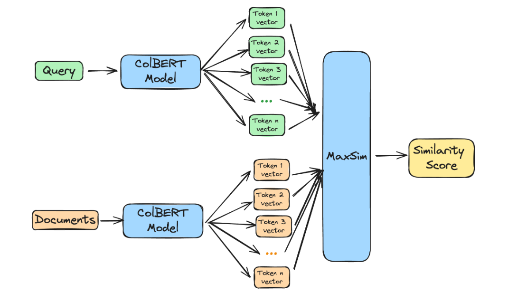

<!-- truncate -->

import { DownloadButton } from '/src/theme/Buttons';

## 🏹Multi-vector retrieval approaches, like ColBERT, have great retrieval quality but vector count can balloon, AnswerAI propose a solution!

Below is an explanation of how ColBERT works and AnswerAI's proposed modification!

## Breakdown of different types of encoders:

**Cross-encoders:**
- Document text & query text strings concatenated and passed into a cross-encoder which then outputs a rank/score.

**Bi-encoders:**
- Document text passed into an encoder and generates a document embedding
- Query text separately passed into an encoder and generates a query embedding
- Similarity of query and doc embedding calculated
- Retrieval performance can suffer especially on Out-Of-Domain data

**Multi-vector bi-encoder - (eg. ColBERT):**
- Functions as a bi-encoder: all documents representations are pre-computed in isolation
- Similarity computation occurs between individual query and document token vectors, as opposed to the full document.

## Main weakness of multi-vector approaches:

1. Storage and memory usage balloons up, each token in a document requires a vector(as opposed to one document = one vector)

2. Complicated to efficiently search through multiple vectors

## AnswerAI's Proposed Token Pooling Solution:

- Main Idea: a lot of the tokens are likely to carry somewhat redundant semantic information, we can semantically cluster them!
- Requires no model modification whatsoever, nor any complex processing, while greatly improving the scalability of easily updatable indexing methods - like HNSW, which are typically harder to use with ColBERT.

**Approach:**
  - Token pooling by clustering similar tokens within a given document and averaging (mean pooling) their representation.
  - After being pooled, the vectors are then quantised to 2-bits using the ColBERTv2 quantisation approach
  - Each cluster is represented by a single token by averaging the values of contained tokens

## Results:
- All results compared to non-pooled ColBERT vector approach
- Pooling by a factor 2 achieves a 50% vector count reduction and 100.6% retrieval performance on average.
- Pool factor = 3 achieves 66% reduction while reaching 99% performance.
- Pool factor = 4 achieves 75% reduction while reaching 97% performance.

[Code](https://github.com/stanford-futuredata/ColBERT)

[Blog](https://www.answer.ai/posts/colbert-pooling.html)

  <DownloadButton link='https://www.answer.ai/posts/colbert-pooling.html'>🔗 Blog Link</DownloadButton>

<!-- We could create a specific template for Paper Review's -->
import WhatNext from '/_includes/what-next.mdx'

<WhatNext />
