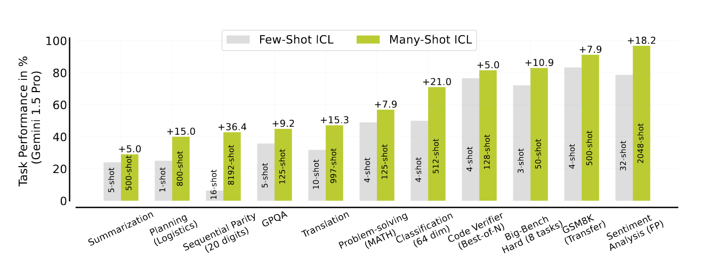

<!-- truncate -->

import { DownloadButton } from '/src/theme/Buttons';

## Should you finetune your LLM or just give relevant examples in the prompt? How many examples should you give for best performance?? If you give more will it hurt perf?? Does order of the examples matter!??

New paper from Deepmind answers all these questions and more, so much to take away from this one, lets dig in!

## Main Takeaways:
- Large performance jumps when going from providing very few(1-5) examples(few-shot incontext learning(ICL) to providing many(100s-1000s) examples(many-shot ICL) - The harder the task the more it benefits from more examples in the prompt!
- Propose using synthetically generated examples(as opposed to human labelled ones) and find that works quite well
- Propose providing only questions and no answers, in the examples, and find this also works quite well!!
- Show that many-shot ICL can overcome pre-training biases, perform comparably to supervised fine-tuning, and learn non-NLP prediction tasks.

## Juicy Details:

- Full supervised/instruction fine-tuning only slightly outperforms many-shot ICL for many tasks

- They mainly test Gemini 1.5 but also try GPT4 and Claude 3.5 and show that different LLMs have varying degrees of success when using many-shot ICL - not a model agnostic trick

- They show that if you provide encough examples in the prompt it can adapt to unseen non-lingual tasks and even in domains that might be misaligned with an LLM’s training data

- Surprisingly, the order of examples in the prompt also influences many-shot performance - would be interesting to see how optimization systems like DSPy can help with this

- Adding more examples, then optimal, in the prompt can also sometimes degrade performance for certain tasks - **weird finding** - opportunity for DSPy to do its thing here aswell

- Many-shot ICL achieves comparable or superior performance when using only problems compared to using problems with solutions - signals that providing solutions with many-shot ICL might just be redundant

- Many shot ICL also shows an improvement in out-of-distribution general problem-solving abilities from in-context learning - Math tasks and etc.

- Biases instilled in the model during pre-training can also be overcome with many shot ICL - a small number of shots leads to the model giving into the bias but with enough examples this eventually diminishes as task learning takes effect in the many shot regime.

  <DownloadButton link='https://arxiv.org/abs/2404.11018'>🔗 arXiv Link</DownloadButton>

  <DownloadButton link='https://arxiv.org/pdf/2404.11018'>📜 Download paper</DownloadButton>

<!-- We could create a specific template for Paper Review's -->
import WhatNext from '/_includes/what-next.mdx'

<WhatNext />
