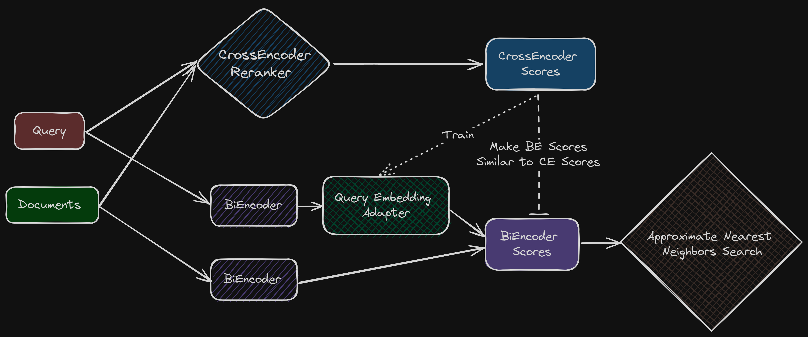

<!-- truncate -->

import { DownloadButton } from '/src/theme/Buttons';

## How do you get the retrieval quality of a cross-encoder/re-ranker and the efficiency of a bi-encoder?

Typically people choose to do this with the trusty old retrieve-and-re-rank approach. 

This new paper from DeepMind proposes Adaptive Cross-Encoder Nearest Neighbor Search, an alternative which approximates the re-ranker query-document similarities while still using a bi-encoder setup.

## High-level Overview:

You can think of this as an efficient way to train an adaptor for the query vector that transforms the query vector in such a way that makes the similarity scores b/w query-documents more like the cross-encoder similarity scores.

- Once you pass the query vector through the trained adopter then you can simply use cosine similarity with the document embeddings
- Can use existing bi-encoder models to initialize the item and query embeddings
- In an offline indexing step -> compute query/item embeddings to index a given set of items from a target domain making sure the similarity scores are similar to cross encoder scores
- At test time -> compute the test query embedding to approximate cross-encoder scores of the given test query for a small set of adaptively-chosen items
- Perform retrieval with the approximate cross-encoder scores

## Details:

At test time, they keep item embeddings fixed and perform retrieval over multiple rounds, alternating between:
	
  >> estimating the test query embedding by minimizing error in approximating CE scores of items retrieved thus far, and 
	
  >> using the updated test query embedding for retrieving more items in the next round.

In the last round once the test query embedding is fully refined, this test query embedding can now be used to retrieve items using cosine similarity.

Proposed k-NN search method can achieve up to 5% and 54% improvement in k-NN recall for k = 1 and 100 respectively over the widely-used DE-based retrieve-and-rerank approach.

  <DownloadButton link='https://arxiv.org/abs/2405.03651'>🔗 arXiv Link</DownloadButton>

  <DownloadButton link='https://arxiv.org/pdf/2405.03651'>📜 Download paper</DownloadButton>

<!-- We could create a specific template for Paper Review's -->
import WhatNext from '/_includes/what-next.mdx'

<WhatNext />
