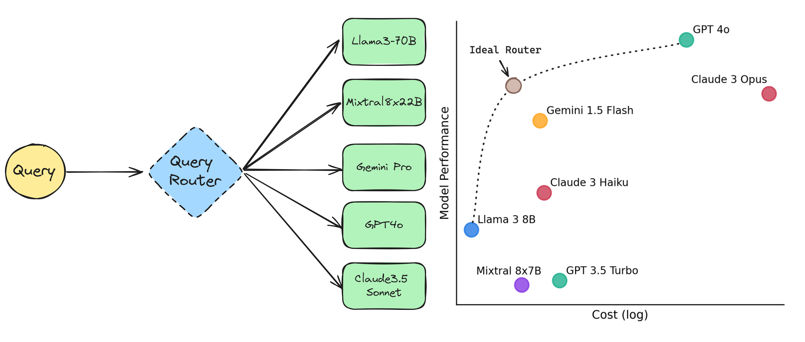

<!-- truncate -->

import { DownloadButton } from '/src/theme/Buttons';

## You don't need a 2 trillion parameter model to tell you the capitol of France is Paris. 

Be smart and route between a panel of models according to query difficulty and model specialty! 

New paper proposes a framework to train a router that routes queries to the appropriate LLM to optimize the trade-off b/w cost vs. performance.

Model inference cost varies significantly: Per one million output tokens: Llama-3-70b ($1) vs. GPT-4-0613 ($60), Haiku ($1.25) vs. Opus ($75)

## Overview:

The RouteLLM paper propose a router training framework based on human preference data and augmentation techniques, demonstrating over 2x cost saving on widely used benchmarks.

They define the problem as having to choose between two classes of models: 
  (1) strong models - produce high quality responses but at a high cost (GPT-4o, Claude3.5) 

  (2) weak models - relatively lower quality and lower cost (Mixtral8x7B, Llama3-8b)

A good router requires a deep understanding of the question’s complexity as well as the strengths and weaknesses of the available LLMs.

Explore different routing approaches:
- Similarity-weighted (SW) ranking
- Matrix factorization
- BERT query classifier
- Causal LLM query classifier

## Neat Ideas to Build From:

- Users can collect a small amount of in-domain data to improve performance for their specific use cases via dataset augmentation.

- Can expand this problem from routing between a strong and weak LLM to a multiclass model routing approach where we have specialist models(language vision model, function calling model etc.)

- Larger framework controlled by a router - imagine a system of 15-20 tuned small models and the router as the n+1'th model responsible for picking the LLM that will handle a particular query at inference time.

- **MoA architectures:** Routing to different architectures of a Mixture of Agents would be a cool idea as well. Depending on the query you decide how many proposers there should be, how many layers in the mixture, what the aggregate models should be etc.

- **Route based caching:** If you get redundant queries that are slightly different then route the query+previous answer to a small model to light rewriting instead of regenerating the answer

  <DownloadButton link='https://arxiv.org/abs/2406.18665'>🔗 arXiv Link</DownloadButton>

  <DownloadButton link='https://arxiv.org/pdf/2406.18665'>📜 Download paper</DownloadButton>

<!-- We could create a specific template for Paper Review's -->
import WhatNext from '/_includes/what-next.mdx'

<WhatNext />
