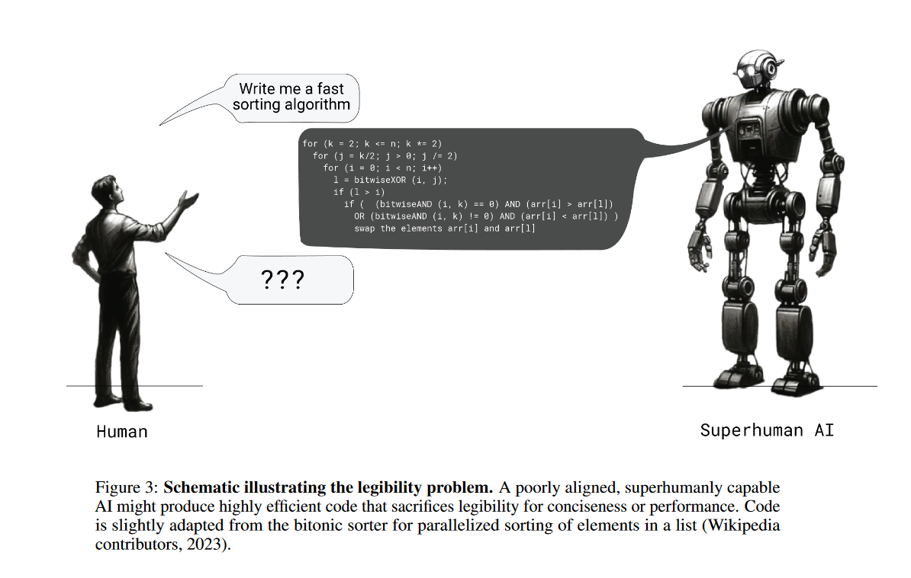

<!-- truncate -->

import { DownloadButton } from '/src/theme/Buttons';

## Training LLMs to write solutions such that smaller models can better check them. This makes them easier to check for humans, too.

## **Key Findings**

1. **Performance vs. Legibility Trade-Off**:    
    - A model with only supervised fine-tuning on human-written derivations achieved high legibility but poor accuracy.
    - Optimizing solely for correctness led to high accuracy but poor legibility.
    - They propose method balanced both, retaining high legibility with moderate accuracy.

2. **They Train Three Models**:    
    - **Robust Verifier**: Accurately distinguishes correct from incorrect solutions, even when misleading.
    - **Helpful Prover**: Generates human-legible solutions, reducing human error.
    - **Sneaky Prover**: Produces subtly incorrect solutions, initially confusing human evaluators and highlighting improvement areas.

## **How It Works**

To train the prover models to produce human-legible text, they use a scheme where the prover's solutions must be easily verifiable by a weaker model. 

They use models from the GPT-4 family with significant differences in pretraining compute, they train using a GAN like(generator and discriminator) alternating training process as follows:
1. Generate multiple solutions to math problems from the prover, some of which are naturally incorrect.
2. Alternate between two training phases:
    - Verifier Training: Train the weak verifier to predict the correctness of the prover’s solutions.
    - Prover Training: Instruct the prover to be either "helpful" or "sneaky," rewarding correct solutions in the former role and incorrect solutions that fool the verifier in the latter.

Initially, the sneaky prover easily deceives the verifier. However, as incorrect solutions are added to verifier training, the prover must continuously develop new strategies. Training concludes when the sneaky prover can no longer deceive the verifier.

**Training Framework**: Multi-agent setup with honest prover (correct solutions) and sneaky prover (deceptive solutions), both checked by a smaller model(robust verifier).

## Details:
    - Unique, effective loss function.
    - Honest prover's solutions become detailed and reasoned over time.
    - Sneaky prover's solutions develop subtler flaws.
    - Legibility transfer: Honest prover’s solutions become easier for humans to verify with training.
    - Humans perform better (speed and accuracy) with more trained models in time-constrained tasks.
    - Traditional reinforcement learning for correctness leads to less legible solutions.
    - Approach helps in training models to explain actions comprehensibly, reducing deception.
    - "Legibility tax" affects large model performance. - as legibility increases performance decreases!

  <DownloadButton link='https://cdn.openai.com/prover-verifier-games-improve-legibility-of-llm-outputs/legibility.pdf'>🔗 arXiv Link</DownloadButton>

  <DownloadButton link='https://cdn.openai.com/prover-verifier-games-improve-legibility-of-llm-outputs/legibility.pdf'>📜 Download paper</DownloadButton>

<!-- We could create a specific template for Paper Review's -->
import WhatNext from '/_includes/what-next.mdx'

<WhatNext />
