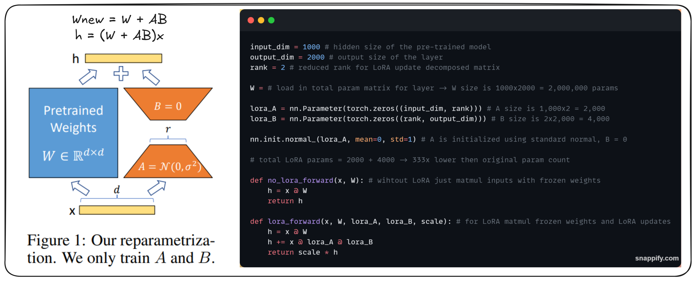

<!-- truncate -->

import { DownloadButton } from '/src/theme/Buttons';

# Detailed explanation of Low-Rank Adaptation (LoRA), a method for efficiently fine-tuning pre-trained neural networks.

## The Problem LoRA Solves:
- In early 2021, Microsoft partnered with OpenAI to explore the commercial viability of GPT-3.
- They found that prompting was insufficient for production tasks like natural language to code generation.
- Fine-tuning was necessary but prohibitively expensive due to the large size of model checkpoints.

## How It Works:

- LoRA generalizes full fine-tuning(updating every single parameter) by asking two questions:
  1. Do we need to fine-tune all parameters?
  2. For the weight matrices we fine-tune, how expressive should the updates be in terms of matrix rank?
- These questions define a 2D plane where full fine-tuning is the top-right corner(full rank and full parameter updates) and the origin represents the original model.
- Any point in this plane is a valid LoRA configuration.

The chosen rank of the update matrix controls the expressivity of the finetuning process.

- A d x d matrix can represent any linear transformation in a d-dimensional vector space.
- By first transforming the input to a lower-dimensional space and then back to the original space, we can restrict the kind of linear transformations that can be represented.
- This reduces the number of parameters that need to be stored from (dxd) to (dxr + dxr) where r << d.
- A point near the origin often performs as well as full fine-tuning. - because often Neural Networks are over-parametrized and thus the weight matrices are full of linearly dependent 
- This suggests that we can start with a low-rank configuration and gradually increase the rank if needed.

## Common practices when using LoRA:

- How to choose the rank R of the update matrix: Start with a low rank and increase it if needed.
- When to use full fine-tuning?: When finetuning on data that is completely new and absent from the pretraining of the base model (for example if you are tuning an English model on Martian then full fine-tuning may be necessary).
- Can I use LoRA for any model architecture?: As long as the model uses matrix multiplication, LoRA can be applied. So basically pretty much every model architecture can use LoRA!

## Benefits of LoRA:

- Reduced checkpoint sizes: On GPT-3, checkpoint size was reduced from 1TB to 25MB.
- No additional inference latency: LoRA updates can be merged with the original parameters during inference. W_new = W_old + AxB
- Ability to quickly switch between tasks: LoRA modules can be loaded and unloaded efficiently.(A_frenchxB_french),(A_germanxB_german),(A_spanishxB_spanish)

## Some interesting engineering ideas enabled by LoRA:

- Caching LoRA modules in RAM for faster model switching and routing between different finetunes.
- Training multiple LoRA modules in parallel on different batches of the training set.
- Creating a tree of adaptive models where each node is a LoRA module.

  <DownloadButton link='https://arxiv.org/abs/2106.09685'>🔗 arXiv Link</DownloadButton>

  <DownloadButton link='https://arxiv.org/pdf/2106.09685'>📜 Download paper</DownloadButton>

import WhatNext from '/_includes/what-next.mdx'

<WhatNext />
