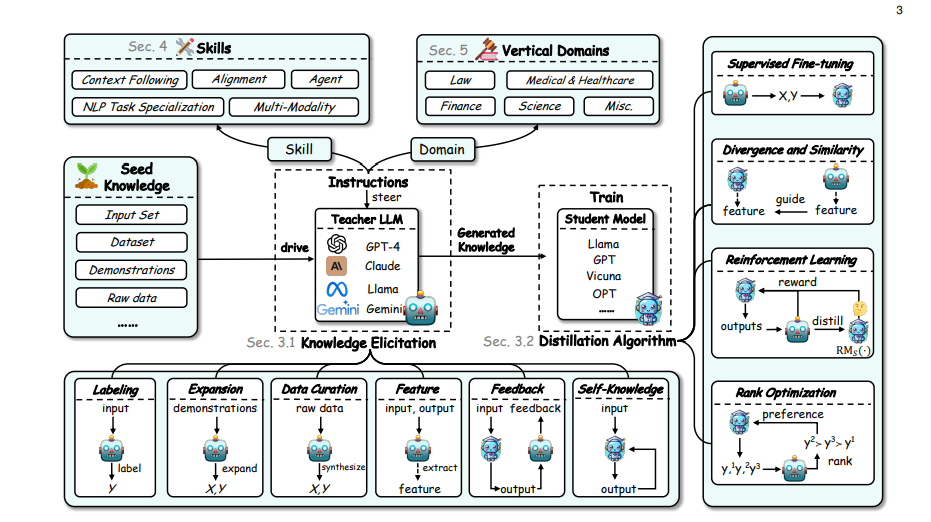

<!-- truncate -->

import { DownloadButton } from '/src/theme/Buttons';

**Distillation has become popular recently due to its ability to efficiently compress the knowledge of larger LLMs into smaller ones. Here’s how it works, why it’s useful, and examples of how you can perform distillation**

## What is distillation? 
Distillation is a model compression technique where a smaller "student" model is trained to mimic the behavior of a larger "teacher" model. This is achieved by transferring knowledge from the teacher to the student, usually through methods like logit-based or hidden states-based distillation. These methods are designed to help the student model replicate the teacher's output distribution or internal representations, often leading to a more efficient model with comparable performance.

## When would we use this?
Distillation is commonly used when deploying large models is impractical due to resource constraints, such as in real-time applications or edge devices. For instance, a smaller student model can be distilled from a powerful teacher model like Llama3.1 405B, retaining much of the original model’s capability but with significantly lower computational demands. Distillation is also useful when adapting models to specific tasks or domains, as seen in domain-specific distillation cases like "function calling," where specialized knowledge from a teacher model is transferred to a smaller model for specific use cases.

## What’s the benefit?
Distillation offers a significant reduction in model size and computational requirements while maintaining a high level of performance. This is especially valuable in scenarios where memory and processing power are limited. Moreover, distillation allows for flexibility in model architecture choices; for example, distilling knowledge from a Llama-3.1-70B model into a much smaller StableLM-2-1.6B model. Distillation methods like those provided in Arcee-AI's DistillKit, including logit-based and hidden states-based distillation, can lead to substantial performance gains over traditional training routines without requiring additional data.

## Examples of Distillation Techniques:

### (1) Logit-based Distillation:
This method involves transferring knowledge by using both the hard targets (actual labels) and soft targets (teacher logits) to guide the student model. The student is trained to minimize the difference between its output distribution and the teacher’s output, typically using Kullback-Leibler (KL) divergence. This method is particularly effective for maintaining performance close to the teacher model while improving the student’s generalization abilities.

### (2) Hidden States-based Distillation: 
Here, the focus is on aligning the intermediate layer representations of the student with those of the teacher. This layer-wise guidance helps the student model capture similar features and improves its performance and generalization. This method also allows for cross-architecture distillation, enabling knowledge transfer between different model architectures, such as distilling from a Llama-3.1-70B model into a StableLM-2-1.6B model.

More resources:
[DistillKit by Arcee AI](https://arcee-ai-distillkit.my.canva.site/)

  <DownloadButton link='https://arxiv.org/abs/2402.13116'>🔗 arXiv Link</DownloadButton>

  <DownloadButton link='https://arxiv.org/pdf/2402.13116'>📜 Download paper</DownloadButton>

import WhatNext from '/_includes/what-next.mdx'

<WhatNext />
