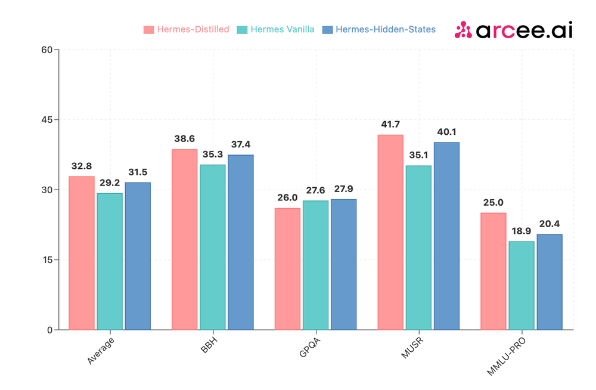

<!-- truncate -->

import { DownloadButton } from '/src/theme/Buttons';

## Is it better to distill or finetune language models?

Arcee did a bunch of experiments comparing model distillation to finetuning, base vs instruct model distillation and more. 

## Main Takeaways:

♦️ Both logit-based and hidden states-based distillation methods consistently outperform standard SFT across various benchmarks.

♦️ General-Purpose Performance Gains: Significant improvements across datasets like OpenHermes, WebInstruct-Sub, and FineTome, particularly in MMLU and MMLU-Pro benchmarks, indicating enhanced knowledge absorption.

♦️ Domain-Specific Performance Gains: Distilling models for domain-specific tasks, especially when using the same training data as the teacher model leads to performance improvements.

## Experiments

♦️Experiment 1: What's better Supervised-Finetune(SFT) or Distill+SFT?

Three models—Hermes-Distilled (logit-based), Hermes-Hidden-States, and Hermes Vanilla (SFT-only)—were evaluated, all distilled from Arcee Spark using a subset of the Teknium's OpenHermes-2.5 dataset (200k examples). Both distillation methods were better than SFT-only model across major benchmarks such as BBH, MUSR, and MMLU-PRO. The logit-based approach was better then the hidden-states-based distillation.

♦️Experiment 2: Effectiveness of Logit-based Distillation in a Generic Domain

The 1.5B Distilled model, trained on a 200k subset of WebInstruct-Sub, demonstrated performance improvements over the baseline Qwen2-1.5B-Instruct model across all metrics. Its performance was also comparable to the teacher model, Arcee Spark, particularly on MUSR and GPQA benchmarks.

♦️Experiment 3: Distillation on Instruct vs. Base Student Models

The 1.5B-Instruct-Distilled model (logit-based), trained on WebInstruct-Sub, showed performance improvements over the vanilla Qwen2-1.5B-Instruct model on the MMLU benchmark, showing benefits of distillation for enhancing knowledge retrieval.

♦️Experiment 4: Effectiveness of Domain-specific Distillation

Distilling Arcee Agent, a 7B parameter model specialized in function calling, into Qwen2-1.5B-Instruct using the same dataset that trained the teacher model resulted in performance gains. This approach underscores the potential of using the same training data for both teacher and student models to achieve even greater improvements, particularly in domain-specific tasks.

More resources:
[DistillKit by Arcee AI](https://blog.arcee.ai/announcing-distillkit/)

  <DownloadButton link='https://arxiv.org/abs/2402.13116'>🔗 arXiv Link</DownloadButton>

  <DownloadButton link='https://arxiv.org/pdf/2402.13116'>📜 Download paper</DownloadButton>

import WhatNext from '/_includes/what-next.mdx'

<WhatNext />
