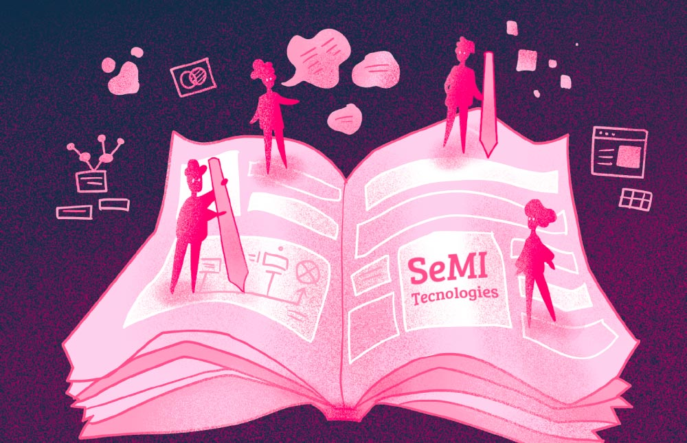

<!-- truncate -->

We're moving towards our goal of creating a profitable, AI-first, open-source company around our vector database, **Weaviate**. With help from our [investors](/company/investors), Weaviate is transforming from a small band of visionaries, into a company - yes, still a small one for now, but a growing one, united by a shared vision. In order to stay true to our open-source spirit as we grow, we want to share that vision with a much larger group of people than just our team. That's the purpose of this blog. We think of it as a meta-conversation about our company.

:::info
That's the purpose of this blog. We think of it as a playbook on how run our company.
:::

Our key audience is the community of developers using our open source solutions such as Weaviate, whether they are open-source users, Weaviate's customers, or others simply investigating our technology. Note that I don't say _only_ users because every download is valuable. I'm sure that in some future post, we'll get into why even non-remunerative users help us to reach our goals. But for now I'll just say that we strive to make them feel valued every day.

Even people who may never become users are understandably curious about an open-source startup's journey. While there have been some notable successes using this business model, the idea of building a tech company without protecting intellectual property still strikes many as counterintuitive. Over time, this meta-conversation will become a resource for future founders.

We're happy to share our vision with other companies on this path, so this blog will be an exercise in radical honesty. Forget NDAs; this is our disclosure agreement. We can be transparent about our strategy because it's execution that matters.

> 💪 We can be transparent about our strategy because it’s execution that matters.

We hope that you'll check back in with us over the coming weeks and months as we put up posts outlining our decision to build a remote-first company, and our experience of creating a cohesive culture over distance; we'll post about engaging a community of developers; engineering solutions for customer success; the unique challenges of building a brand in an open-source company; and the process by which we'll create valuable products around our open-source vector database - something that's obviously essential if our strategy is to work!

Over time, we hope to build a document that both records our evolution and may serve as a road map for other founders facing similar challenges. Our decision is to be not just an open-source company, but an “open book”. So, documenting our approach with complete transparency is not just a business decision but also a philosophical position.

This is simply who we are, as founders, a team, and company. Or I should say, it's an introduction. Keep coming back to get a clearer and clearer picture.

import WhatNext from '/_includes/what-next.mdx'

<WhatNext />
