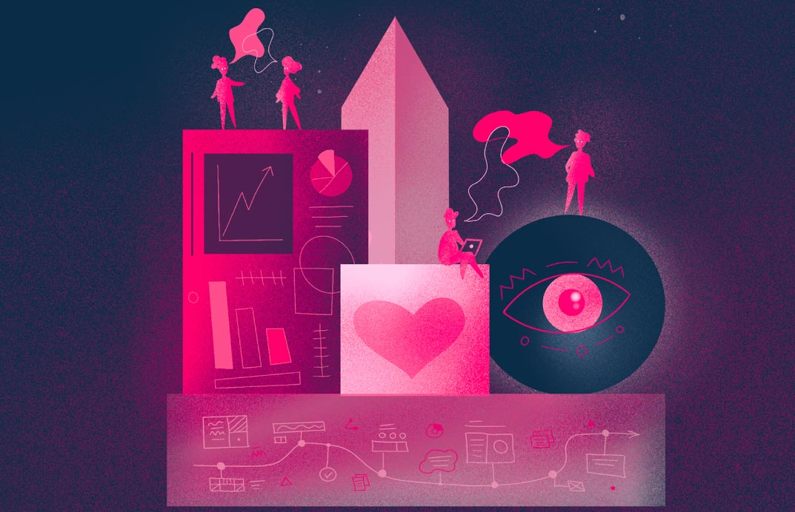

<!-- truncate -->

Here at Weaviate, we aren't just building open-source products, we're building an open-source brand.

To create a meaningful product, we need to both solve a problem and know the people we're building it for. To create a meaningful brand, we need to know why we're solving that problem, and who we are.

Creating that brand in an open-source spirit does not call for the traditional brand-building techniques used to shape a message. Rather, our goal is to transparently share our experiences as team members connect with each other and our users, to help them solve their problems.

For the last eight years, I've helped tech companies build their brands and visual identities. I've learned an important lesson: Businesses that don't know why they exist and what they are trying to achieve struggle to find product-market fit.
They have no strategy or vision, creating confusion for the team and, inevitably, their customers.
They don't know who they are talking to and without a clear value proposition, they waste money on Google ads and paid campaigns that don't bring measurable results.
They copy their competitors and hope for the best.
Without consistent messaging—and especially without communicating values—they can't attract the right talent.

Too many tech companies are focused on their product—understandably the center of many founders' universes—when they should focus on people and their experience with the brand. That's especially true for us as, in the spirit of open source, we'd rather build our brand from the bottom up than dictate it from the top down.

### How we'll do it at Weaviate

It's not a one-person job. We need to involve every level of the organization.

First, we are doing the work required to create a shared understanding of who we are as a company. This takes a lot of reflection, thinking, brainstorming and time. That time and energy helps us to define our values, purpose and vision. Those are foundational to the brand but also aspirational—they're the stars that we'll use to navigate our future as a company.

Those values will be reflected in clear, transparent, and forthright visual language, creating an identity that will help us make the right decisions by reminding us who we are when we're our best selves and honestly portray us to future users, customers, and team members.

At Weaviate, we believe that our brand is not performative; it's not mainly about the company logo or nice images on the website (although I do definitely care about those things!) The brand is felt more than seen. It is defined by the way people feel about our products and services. It's not shaped by our claims, but rather by people's experiences and interactions with us. That's why one of our main goals is to create the best brand experience for our users.

We use the concept of an open-source brand to share our processes, experiences, successes and failures. And people's feedback will help us improve, resulting in better business decisions and ever-stronger relationships.

In future posts, I will share more about how we're building our brand; why visual design is important, especially in the tech industry; and I'll write more about our design processes as we continue to develop a visual style and experiment with a logo design. We intend to be entirely open about this process. That's only right, considering who we are.

import StayConnected from '/_includes/stay-connected.mdx'

<StayConnected />
