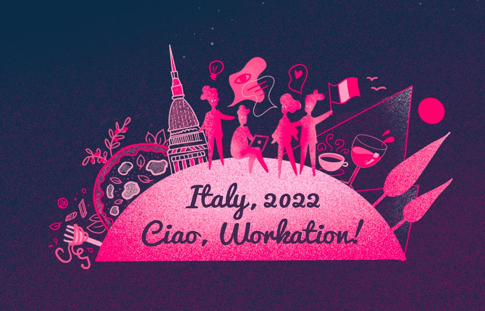

<!-- truncate -->

Over the past six months, Weaviate has doubled in size; we’re now nearly 30 people. At this point, we have team members based in Europe, the U.S., South America, and Australia. Some colleagues who have been working closely on the same team for months have never met face-to-face. So, we’re super-excited that in a couple of weeks, we’ll all be in the same place, at the same time, for the first time. As a bonus, it’s in Italy!

Our location is [The Workation Village](https://www.theworkationvillage.com/) in the Piemonte region of Italy. This was an actual village for centuries, though like many Italian hill-towns, it lost most of its population in recent decades. A group of entrepreneurs have restored the buildings, and created an idyllic rural campus. They describe it as “A magical place in nature for team retreats and company offsites - to reconnect in the remote age and to be inspired.”

## IRL meetings are essential for remote-first companies

We’re committed to our remote-first structure. Despite the distance between us, we put a lot of effort into creating a cohesive team spirit. But we also believe that the experience of coming together is an important aspect of building and fostering a strong remote culture. Those two ideas - of that strong remote culture, and in-person bonding - are not opposites, they’re complements. So yes, we choose to work from coworking places, coffee cafes, our homes, or wherever. But we also want to build the strongest possible relationships. We’ve already felt that happen in situations, such as meeting each other at conferences, that brought together quite a few of us; that convinced us that those IRL moments are helpful. And if we have such moments in a beautiful Italian village… We’ll just have to power through it ;-)

By now, you may already have the sense that we’re all very excited about this idea; personally, I can’t wait. It will be fun, but that’s not the only reason why we’re doing it. It’s a workation, not a vacation. We’re doing it because creating better and stronger bonds and relationships, and engaging in intensive collaboration and brainstorming, will help Weaviate to achieve its business goals. I’ll report back after our workation, but we’re already sure that spending some time together IRL will result in more and better work output-that you may see in everything from new and creative use cases for Weaviate to revisions to our website.

> 💡Our recipe for a winning workation: Enjoy yourselves, be yourselves, do your own thing

After months or years of remote work, an entire week with colleagues could be intense. In order to ensure that Weaviate as a company and the team as individuals have the best outcomes and experiences, we have planned our workation along the following principles…

1. **Give people flexibility.** We’ll have lots of activities to choose from, but they’ll be optional. People can have a week that is as packed - or as relaxed - as they want. And, we’ll have a diverse range of activities; some sporting, others cultural. (Of course, many Italian cultural experiences revolve around food and wine. Our experience will include a pasta-cooking workshop and wine tasting.)

2. **Don’t over-engineer the program.** We want to leave space for spontaneous activities; those are usually the most fun anyway.

3. **Have those ‘all-together’ moments as a company.** Our dinners will be times to come together with the entire group. They’ll be held in the village’s trattoria, where long tables can accommodate our whole team. Our founders, Bob van Luijt and Etienne Dilocker are planning to host a special dinner; they’ll cook and select great wines.

## Building the UX for a company trip

My goal is to organize a workation where everyone gets what they are looking for. Of course, I know what would be fun for me, but what about other people? Everyone has their own ideas, so I sought input and feedback on the program from some of my colleagues. One thing I heard back from our engineers is that they really like to get into a flow; when they’re focused on a work challenge in a hackathon, they like to extend it into the evening as well. That was a really good insight for me, as I don’t have that preference. I guess what I’m saying is that, as with any other UX, you have to keep the customer - in this case my colleague - in mind!

As you can probably tell, I’m really excited about this trip! My goal is that people enjoy each other's company and that we all leave Italy even prouder to be part of our Weaviate team. If that happens, we’ll be that much closer to achieving our goals as a company. We’ll share our experiences in Italy, so please follow us on Twitter, LinkedIn, and (new!) Instagram as we post from The Workation Village, beginning on the 5th of November!

import StayConnected from '/_includes/stay-connected.mdx'

<StayConnected />
