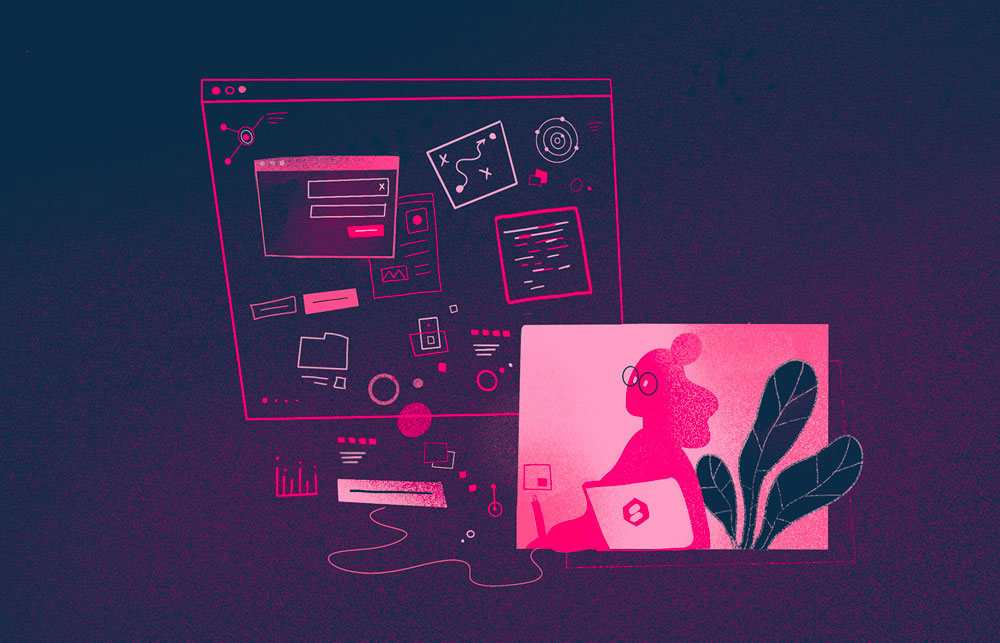
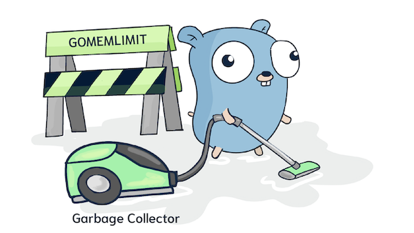
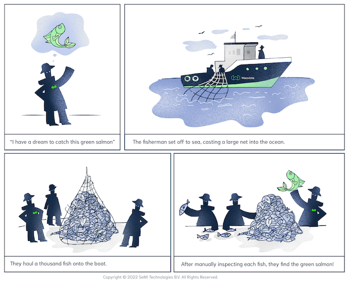
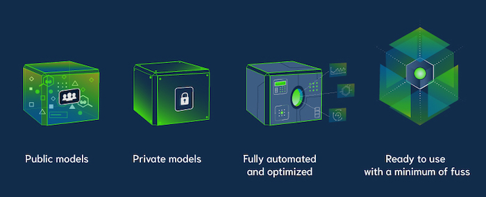

<!-- truncate -->

You’re *reading* this blog, not just looking at it. And most of the ideas in this post are conveyed in words. But admit it: The first thing that caught your eye was that cute drawing of the GoLang gopher holding a vacuum cleaner.

*Even though a paragraph of text precedes this image, you probably looked at this picture before it. Congratulations, you’re a human, not a robot.*

There’s a good reason for that. For most of human evolution, written language didn’t even exist. We had to identify plants - some were poisonous, others were nutritious - based on what they looked like, not printed labels at the supermarket. Our brains evolved to process images, not text. As a result, we still process images much faster than words.

## Visual design is more than aesthetics. It’s also strategic.

We are all swimming in content. Website interfaces, social media messages, videos and images, printed material… It has all been designed and usually the designer’s goal has been to communicate a message, not just make it pretty. Design is especially useful in a “borderless” business like Weaviate because people all over the world understand the same visual language.

One of our main goals at Weaviate is to share knowledge about Weaviate in particular and vector search technology generally. Many people are confused by terms like, "vector database", "cloud native", or "open source", and the key technical concepts related to search technology can be hard to verbalize. We’ve found that creating visual stories - especially using analogies from the real world - is beneficial. For example, we visualized multi-stage search as a story about a fisherman searching for one particular fish.

Visual design also gives us great tools to add emotional value to content. For example, we’ve created several visuals for Hugging Face models; one that the public has access to, one that’s private, one’s fully automated, one’s ready to use. We created different visuals for each type of model to help our community and customers understand the differences between models and choose the one that best suits their specific use case.

Another reason that visual design is particularly important to Weaviate is that as an open-source company, we benefit from a cohesive community of users. Images and symbols have reinforced peoples’ sense of community since ancient times, and they’re still effective.

When we introduced a new [Garbage Collection feature](/blog/gomemlimit-a-game-changer-for-high-memory-applications), we illustrated it by giving the popular Golang Gopher character a vacuum cleaner. Developers love this little guy and using his image (yes, it’s open source!) reinforced bonds with developers in our community.

## Four tips to help you leverage visual design in almost any company

Making smart use of visual design can help you to engage with your customers and community as well as improve internal communications and processes within your company. Here are four tips that will work in almost any organization:

* Be consistent. Keeping your visual language consistent makes your brand recognizable.
* Add emotion. Think about what you want people to feel and be intentional about adding emotion to your design.
* Use visual analogies. Illustrate complex or novel ideas with familiar, real-world analogies the viewer already understands.
* Use design to align on goals. If you visualize an idea or strategy with your team and/or customers, everyone can literally keep the same goals in sight.

import StayConnected from '/_includes/stay-connected.mdx'

<StayConnected />
