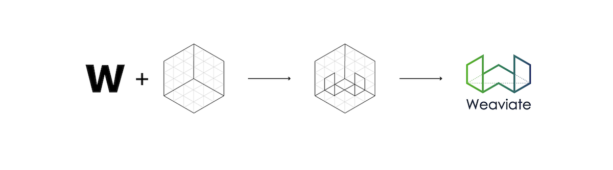

In January 2023, SeMI Technologies became Weaviate as we aligned our company under the brand of our well-known vector-search product. Adopting Weaviate as the name for our company created the opportunity, and gave us an incentive, to develop a new graphic identity.

Rebranding was an opportunity to reflect on who we are now and where we're going. It's a chance to evaluate messaging, visual identity, and our overall brand strategy; and to get creative and build something great together.

It was an even bigger deal for me because as a graphic designer, creating a new corporate identity from a clean sheet of paper is a rare treat. (And if you’re wondering, my creative process typically does start on paper!)

<!-- truncate -->

*Exploration of Weaviate logo, sketches (2018)*

*First Weaviate logo concept (2018)*

I began with a review of other companies in the space, or adjacent to it—both to get a sense of the visual language being used, and to rule out any solutions that might be confusingly similar to another company’s.

During my research, I was struck by the sameness of many tech firms’ visual identities. Logos were typically “flat” and for companies in the vector-search space, some variation on an isometric cube or grid—implying dimensionality—was common. Websites were templated, with similar layouts, colors, and fonts. Of course, simplicity is good… but too much of it is boring.

Although one might think of developers as particularly rational types, part of my research involved talking to developers about the things they thought were interesting or cool. They cited things like games and virtual reality; a lot of what they thought was interesting was also fun.

Creating a unique brand that reflects our cultures and values; differentiating ourselves from competitors, and attracting fresh attention were all givens. We also decided on two important and very specific objectives for a new Weaviate identity.

*Weaviate logo transformation by Mihai Dolganiuc (2022)*

First, we wanted to bring Weaviate to life with a logo that felt real and substantial, not flat. As a software company, we don’t produce “things” with their own distinctive designs. (Think of a company like Apple or Tesla; sure, they have carefully crafted logos and such but, in the end, their visual identities are defined by their products.) For us, our logo and graphic style is our whole visual identity. So, to emphasize that we’re a real company doing things in the real world, we wanted to use a three-dimensional style.

*Weaviate logo in 3D by Constantin Calcatinge (2022)*

Second, we wanted an identity that was fun—even toy-like—with bright colors and playful fonts. To achieve those objectives, I collaborated with a logo designer, Mihai Dolganiuc, and a 3D artist, Constantin Calcatinge. Beginning with an earlier Weaviate product logo (yes, one that also took inspiration from a flattened cube) Mihai first transformed it into a rounded object with vibrant color overlays and then Constantin turned it into a realistic 3D object.

*Realistic 3D Weaviate logo (2022)*

In the vector-search space, a lot of companies use some variation on a dimensional grid to give a sense of high dimensionality. We chose to imply that sort of space in the different way, by floating the logo in a loose galaxy of vectors. Our users typically work on fairly powerful devices and have lots of bandwidth, so the logo can also be animated.

As an open-source tool, Weaviate is something you can install and play around with. We want you to try it out, explore it, break it, improve it, and be creative. We worked hard to translate all of that into our new logo and visual identity. We hope you want to grab it and play with it!

import StayConnected from '/_includes/stay-connected.mdx'

<StayConnected />
