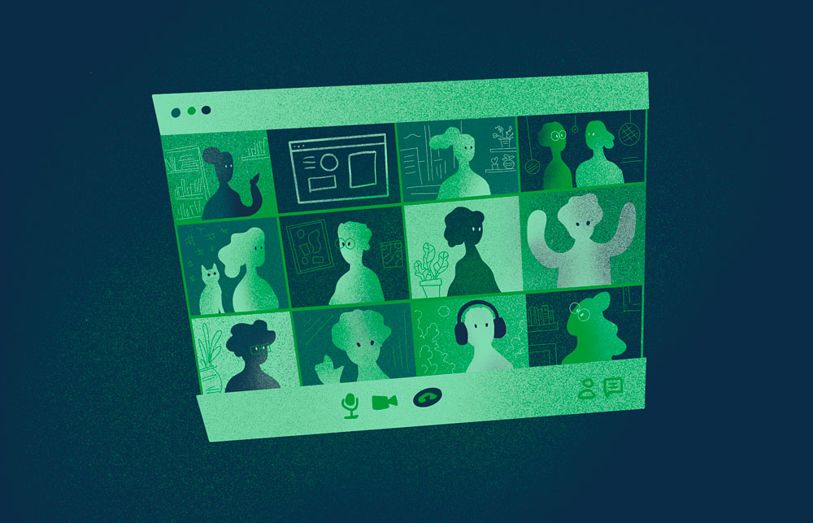

<!-- truncate -->

**Weaviate continues to grow. All the more reason to ensure that our All Hands sessions contribute to preserving a valued work environment and sense of community.**

When I arrived at Weaviate, our All Hands sessions were mainly a way to spend time together as a team. Just a year ago, we could have an All Hands in which everyone was able to share how they were doing and what they were up to. However our company has doubled in size, and–spurred by a recently completed Series B round and the realization that our vector database can function as a critical layer in a generative AI stack–we expect to grow again in the coming year.

That change in scale means we have to reshape our All Hands because there are simply too many people for a loosely structured meeting to be practical. But beyond those practical concerns, our get-togethers don’t only reflect our values, they also help to reinforce them.
So, I’ve given our All Hands set-up a makeover.

## Defining goals

The first step in any makeover or renovation project is having a clear objective. So, I had to ask, “What do we want to get out of our All Hands session ?” The first three points I came up with are nearly universal:
1. Keep everyone up-to-date on important company news and aligned on our strategic objectives.
2. Celebrate our people and their/our successes (a very important one to me!).
3. Give people an opportunity to speak and share (their work).

But the fourth point might give you a better sense of who we are as a company:

4. Foster a company culture that embodies our values:
    * Transparency
    * Kindness
    * Collaboration
    * Trust
    * Excellence

## Achieving goals, reinforcing values

In the spirit of **#transparency**, the first element of the session is an update on our goals and strategy.

Connected to our value of **#kindness**, we celebrate people and the awesome work they have done. One fun way we do that is by encouraging everyone to nominate a “Weaviate Hero”. The idea here is to give a colleague a compliment and express appreciation before the entire group. Some people do this naturally or show appreciation in other ways; others are more reserved. But every single person at our company does great work, so we’ve created a moment to focus on their contributions to our success.

The idea is simple; anyone can submit the name of a colleague, and explain why that person is their hero. Often the compliments are related to a project or feature that they’ve completed, but any special act can be acknowledged. It’s very cool and energizing to hear everyone–even more introverted team members–celebrating with each other. A colleague contacted me afterwards to point out that we don't need to wait for our bi-monthly All Hands to give such props. He suggested a way to do it in Slack, and we have adopted this practice, too.

One way to embody our value of **#collaboration** grew out of last autumn’s company trip in Italy. At the end of that week, we hosted two demo sessions in which people showed what they were working on. Seeing that work-in-progress encouraged the rest of us to ask questions, share perspectives, and imagine the ways we might help those ideas reach production and be successful. Those demos were so popular that we decided to make them a regular feature of our All Hands. This is a great way to support each other moving forward.

If a colleague wants to contribute to the All Hands, I **#trust** their content. I don’t review anything in advance. I may provide some guidelines about the goals or purpose of these team updates, but I don’t interfere with their contributions.

We’d like to have a lively and freewheeling Q&A because we want people to feel comfortable asking questions, sharing their thoughts, even (perhaps especially!) voicing any doubts or worries. Even if only one person speaks up, others often have the same thoughts we may all benefit from the discussions that follow. I admit that so far, few questions are being asked, so if you have suggestions about ways to encourage a free flow of questions, feel free to leave a comment!

Overall, I’m happy with the changes that we’ve made to our All Hands sessions–which are especially important in remote companies like ours. I think the lesson is that, just as our software evolves in a series of iterations as we strive to perfect each product, so must our cultural processes and practices iterate if we are to preserve our values and culture through this period of rapid growth.

In this way, even our All Hands sessions strive for **#excellence**.

import StayConnected from '/_includes/stay-connected.mdx'

<StayConnected />
